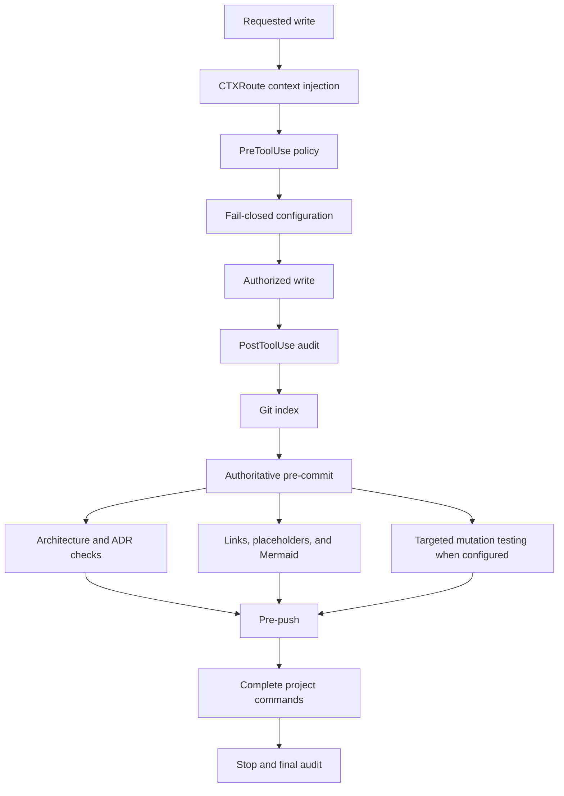

# Template governance

`.project/project-config.json` is the single source for project decisions,
source directories, code extensions, contracts, and commands.

While the project status is `template`, its `starter` paths are also a
completeness manifest: every declared infrastructure root and root file must
exist. Derived projects may revise that manifest during approved initialization
and cleanup.

`.codex/architecture-policy.json` only locates that configuration and declares
allowed states. CTXRoute loads relevant rules from `.claude/hooks/docs/` through
the portable `.codex/hooks/ctxroute.mjs` wrapper.

PreToolUse provides immediate feedback. Git hooks remain authoritative because
they inspect the index and capture files produced by commands or external tools.
