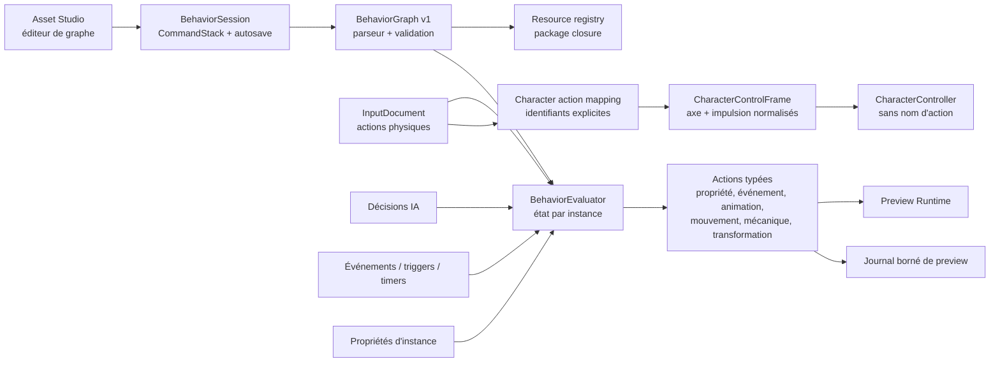

# Composants — BehaviorGraph

Le contrat ne contient aucun handle runtime. Les identifiants de nœuds, ports,
paramètres et connexions sont stables dans le document. Les sources convergent
vers le même type `signal`; les valeurs de données gardent un type explicite.
Les cycles de flux sont refusés. Les nœuds `state`, `transition`, `delay` et
`cooldown` portent leur mémoire dans l'évaluateur d'instance.

Le contrôleur physique CLI optionnel ne déroge pas à ce découplage :
`PreviewRuntimeOptions.character_actions` choisit trois actions du document
Input, puis le contrôleur ne reçoit que leurs valeurs normalisées.
