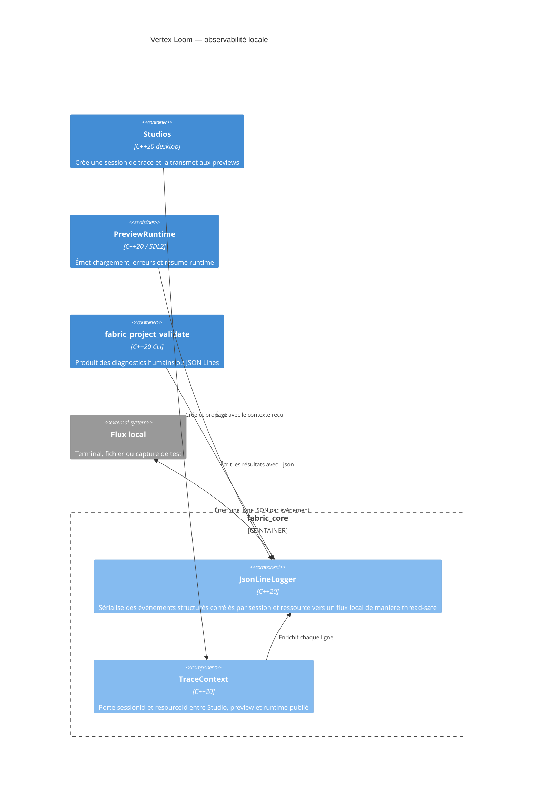

# C4 Component — observabilité locale

## Contract

Chaque ligne contient `timestampMs`, `level`, `category` et `message`. Le bloc
`context` optionnel porte `sessionId` et `resourceId`; les autres champs sont
placés dans `fields`. Le logger échappe les caractères de contrôle et
n'effectue aucun accès réseau.
