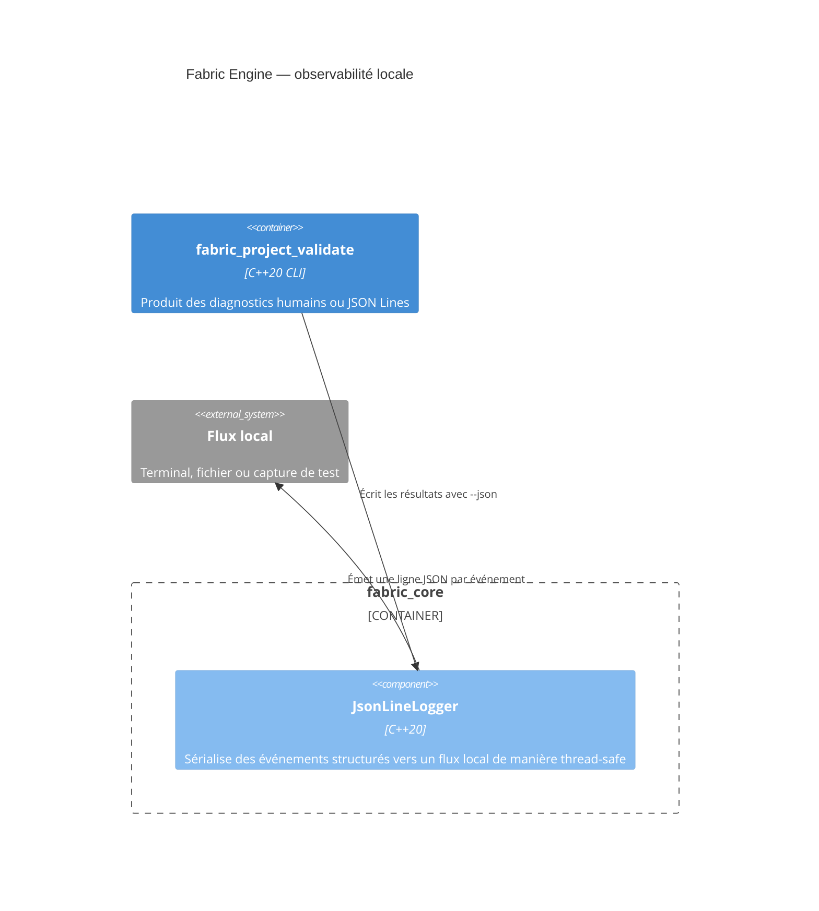

# C4 Component — observabilité locale

## Contract

Chaque ligne contient `timestampMs`, `level`, `category` et `message`. Les
champs contextuels sont placés dans l'objet `fields`. Le logger échappe les
caractères de contrôle et n'effectue aucun accès réseau.
