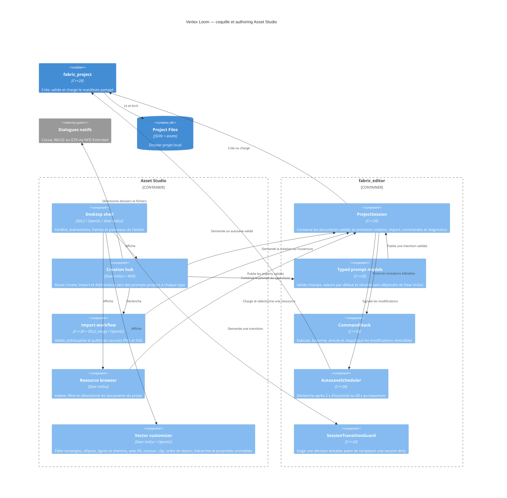

# C4 Component — coquille Asset Studio

## Contract

- Le chemin peut être fourni au démarrage ; les actions interactives utilisent
  le sélecteur natif de dossier ou de fichier.
- La création demande un nom et un dossier parent existant. Le dossier projet
  final est calculé comme `<parent>/<identifiant-généré>` et doit être absent ou
  vide ; le dossier parent peut contenir d'autres fichiers.
  L’identifiant interne est généré depuis le nom et rendu unique sans saisie
  utilisateur. Son modèle typé porte unités monde,
  `pixelsPerUnit`, preset d’échelle, erreurs par champ, destination exacte et
  résumé avant publication.
- `Create`, `Import` et `Add existing` sont trois intentions distinctes. Chaque
  type possède son état et sa validation ; annuler ne modifie aucun document.
- Le hub affiche séparément `Create`, `Import` et `Add existing`. Projet,
  artwork et chaque source d’import possèdent un état isolé. `Add existing`
  ouvre un sélecteur des ressources déjà indexées et ne publie aucun document.
  Les actions matériau, entité et animation utilisent leurs prompts typés et
  publient des documents validés avant réindexation.
- Le panneau gauche liste les ressources réellement présentes, conserve une
  sélection explicite et n'affiche pas de faux nœuds de dossier interactifs.
  L'index est reconstruit à l'ouverture et après publication ; sélectionner
  recharge le document validé et son aperçu depuis le projet.
- Le hub de création sépare maintenant `New material / fill` des imports et
  artworks. Le prompt produit un `MaterialDefinition v1` validé, publié
  atomiquement dans `assets/materials` puis réindexé comme ressource
  sélectionnable.
- Le hub propose aussi `New entity...`. Le prompt crée un nœud racine avec
  drawable, matériau optionnel et transform, valide les références locales,
  publie atomiquement dans `entities`, puis réindexe l’entité.
- Le hub propose `New animation...`. Le prompt crée un `AnimationClip v1`
  avec durée, boucle et marker optionnel, le publie atomiquement dans
  `assets/animations`, puis le réindexe sans imposer de piste métier.
- L’inspecteur d’entité liste les nœuds dans leur ordre stable et permet de
  modifier nom, parent et transform. Chaque mutation passe par
  `CommandStack`, reste undoable et ne peut pas introduire de cycle ou de
  transform non fini.
- Le canvas et l'inspecteur dérivent uniquement de la sélection courante. Les
  réglages du manifeste vivent dans une fenêtre `Project settings` distincte.
- Ouvrir, créer, fermer ou quitter avec un document dirty demande `Save`,
  `Discard` ou `Cancel` avant de remplacer la session.
  `Cancel` et un échec de `Save` conservent la session et son historique ;
  `Discard` n'abandonne l'état courant que si l'action suivante aboutit.
- L’assistant d’artwork valide taille de travail, origine, unités, première
  forme et fill ; il résout seul les conflits d’identifiant. Un fill image référence une texture
  locale et expose cadrage, offset, rotation, échelle, opacité et suivi de la
  déformation. La confirmation publie un `VectorAsset v2 native` atomique.
- Une ouverture échouée expose les erreurs structurées et ne remplace pas la
  dernière session valide.
- SDL2 possède la fenêtre et les événements ; Dear ImGui possède uniquement
  l'interface d'outil ; OpenGL efface et présente la surface.
- Un import réussi conserve le `TextureAsset` et les pixels décodés pour
  l'aperçu ; un échec conserve le dernier import réussi.
- Un import PNG ou SVG décode et présente d'abord un aperçu temporaire. La
  publication ne se produit qu'après confirmation de l'utilisateur.
  Annuler libère cet aperçu et ne modifie ni la sélection ni les fichiers du
  projet. Les fills image choisissent une texture indexée par son nom visible.
- Un import SVG réussi conserve le `VectorAsset` et son aperçu RGBA8 borné ;
  un échec conserve le dernier import vectoriel réussi.
- Asset Studio n’expose aucun import sprite ; PNG alimente les textures et SVG
  les ressources vectorielles liées conformément à ADR-0025.
- Toute mutation d’un document éditable passe par `CommandStack`. Les imports,
  qui créent des ressources immuables sans remplacement, restent hors de cet
  historique de document.
- La tranche native intégrée rend rectangles et ellipses, cadre le document,
  zoome sous le curseur, permet le pan et affiche une grille adaptative en
  unités monde. L'inspecteur sélectionne et édite un nœud :
  nom, visibilité, verrouillage, parent, clip, transform, couleur et paramètres
  de fill image. Les sélecteurs parent et clip proposent uniquement les autres
  nœuds du document ; la validation de session refuse ensuite les cycles ou
  références invalides.
- Le canvas natif expose les outils déplacement, rotation, échelle et pivot.
  Les poignées de rotation, d’échelle et de pivot sont dessinées autour du
  nœud sélectionné ; un geste continu est fusionné par `CommandStack` en une
  seule mutation undoable. Le déplacement du pivot compense la position afin
  de ne pas déplacer visuellement la forme.
- Le canvas natif envoie les draw packets validés au backend OpenGL 3 dans le
  viewport courant. Le resolver charge à la demande les `TextureAsset` locaux,
  les met en cache GPU pendant la session et les fournit au sampler image ; le
  fallback ImGui reste disponible si une texture ne peut pas être résolue.
- Les formes `line` et `path` sont des géométries natives. Un chemin conserve
  ses commandes `move`, `line`, `cubic` et `close`; son aperçu aplatit les
  Bézier en mémoire sans persister une rasterisation.
- Un nœud peut conserver un contour avec couleur, largeur, jointure et
  extrémité ; les nœuds sont composés dans l’ordre stable de `native.nodes`.
- Les nœuds natifs peuvent référencer un parent et un clip par identifiants
  locaux ; le validateur refuse les références manquantes et les cycles avant
  publication.
- Un seul document porte des changements à la fois. Changer de ressource avec
  un vecteur dirty est refusé jusqu'à Save ou Undo ; les historiques propres
  sont neutralisés avant de changer de document.
- La session expose undo, redo et dirty et ne marque clean qu’après une
  sauvegarde principale réussie.
- Save et autosave ciblent le document actif : `project.json` pour les réglages
  projet, le document `VectorAsset` ou le document `EntityDefinition` sélectionné
  pour l'édition.
- `CommandStack::execute` accepte une commande possédée par la pile ;
  `can_undo`, `can_redo`, `undo`, `redo`, `mark_clean` et `dirty` exposent son
  état sans dépendance à Dear ImGui.
- Une récupération plus récente est proposée à l’ouverture ; accepter charge
  son contenu en mémoire, refuser conserve le principal, sans écriture implicite.
- Les raccourcis affichent et utilisent `Cmd` sur macOS et `Ctrl` sur Windows
  et Linux. Ils restent inactifs lorsqu'une modale requiert une décision.
- Le manifeste constitue le premier document éditable intégré : son nom et ses
  unités passent par commandes, Save remplace `project.json`, et son autosave
  sert de preuve headless du flux commun avant les futurs documents d’asset.
- Les entités sélectionnées utilisent le même flux headless : édition de nœud,
  undo/redo, sauvegarde atomique, autosave miroir et récupération validée.
- Le viewport d’une entité résout les drawables vectoriels et texturés, compose
  les transforms parent/enfant et applique le matériau avant d’envoyer les
  draw packets au renderer OpenGL. Les textures locales sont résolues par le
  même cache GPU que les artworks natifs.
