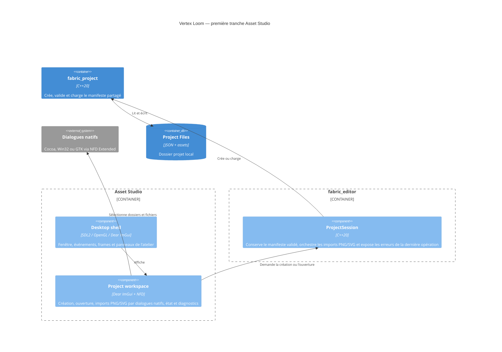

# C4 Component — coquille Asset Studio

## Contract

- Le chemin peut être fourni au démarrage ; les actions interactives utilisent
  le sélecteur natif de dossier ou de fichier.
- La création demande un nom, un identifiant de ressource valide et un dossier
  de destination absent ou vide.
- Une ouverture échouée expose les erreurs structurées et ne remplace pas la
  dernière session valide.
- SDL2 possède la fenêtre et les événements ; Dear ImGui possède uniquement
  l'interface d'outil ; OpenGL efface et présente la surface.
- Un import réussi conserve le `TextureAsset` et les pixels décodés pour
  l'aperçu ; un échec conserve le dernier import réussi.
- Un import SVG réussi conserve le `VectorAsset` et son aperçu RGBA8 borné ;
  un échec conserve le dernier import vectoriel réussi.
