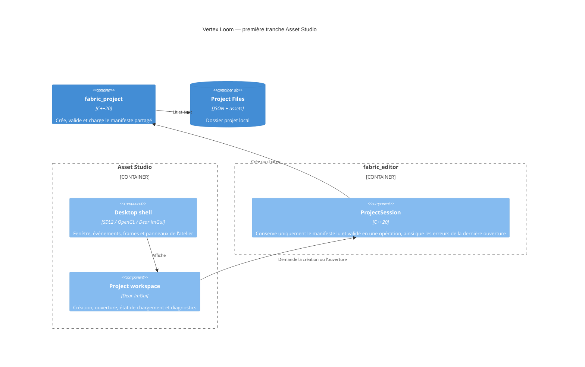

# C4 Component — coquille Asset Studio

## Contract

- Le chemin peut être fourni au démarrage ou saisi dans l'atelier.
- La création demande un nom, un identifiant de ressource valide et un dossier
  de destination absent ou vide.
- Une ouverture échouée expose les erreurs structurées et ne remplace pas la
  dernière session valide.
- SDL2 possède la fenêtre et les événements ; Dear ImGui possède uniquement
  l'interface d'outil ; OpenGL efface et présente la surface.
- Aucun import ou rendu d'asset n'est introduit dans cette tranche.
