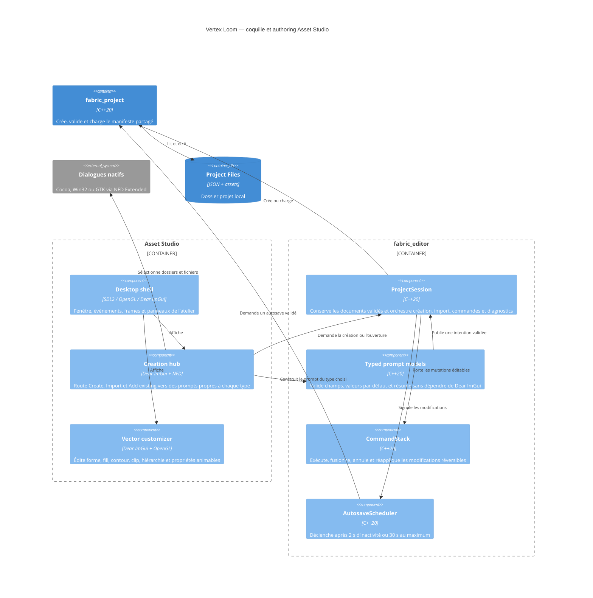

# C4 Component — coquille Asset Studio

## Contract

- Le chemin peut être fourni au démarrage ; les actions interactives utilisent
  le sélecteur natif de dossier ou de fichier.
- La création demande un nom et un dossier de destination absent ou vide.
  L’identifiant interne est généré depuis le nom et rendu unique sans saisie
  utilisateur. Son modèle typé porte unités monde,
  `pixelsPerUnit`, preset d’échelle, erreurs par champ, destination exacte et
  résumé avant publication.
- `Create`, `Import` et `Add existing` sont trois intentions distinctes. Chaque
  type possède son état et sa validation ; annuler ne modifie aucun document.
- Le hub affiche séparément `Create`, `Import` et `Add existing`. Projet,
  artwork et chaque source d’import possèdent un état isolé ; les actions
  matériau, entité, animation et ajout existant restent désactivées jusqu’à
  l’arrivée de leur contrat.
- L’assistant d’artwork valide taille de travail, origine, unités, première
  forme et fill ; il résout seul les conflits d’identifiant. Un fill image référence une texture
  locale et expose cadrage, offset, rotation, échelle, opacité et suivi de la
  déformation. La confirmation publie un `VectorAsset v2 native` atomique.
- Une ouverture échouée expose les erreurs structurées et ne remplace pas la
  dernière session valide.
- SDL2 possède la fenêtre et les événements ; Dear ImGui possède uniquement
  l'interface d'outil ; OpenGL efface et présente la surface.
- Un import réussi conserve le `TextureAsset` et les pixels décodés pour
  l'aperçu ; un échec conserve le dernier import réussi.
- Un import SVG réussi conserve le `VectorAsset` et son aperçu RGBA8 borné ;
  un échec conserve le dernier import vectoriel réussi.
- Asset Studio n’expose aucun import sprite ; PNG alimente les textures et SVG
  les ressources vectorielles liées conformément à ADR-0025.
- Toute mutation d’un document éditable passe par `CommandStack`. Les imports,
  qui créent des ressources immuables sans remplacement, restent hors de cet
  historique de document.
- La session expose undo, redo et dirty et ne marque clean qu’après une
  sauvegarde principale réussie.
- `CommandStack::execute` accepte une commande possédée par la pile ;
  `can_undo`, `can_redo`, `undo`, `redo`, `mark_clean` et `dirty` exposent son
  état sans dépendance à Dear ImGui.
- Une récupération plus récente est proposée à l’ouverture ; accepter charge
  son contenu en mémoire, refuser conserve le principal, sans écriture implicite.
- Le manifeste constitue le premier document éditable intégré : son nom et ses
  unités passent par commandes, Save remplace `project.json`, et son autosave
  sert de preuve headless du flux commun avant les futurs documents d’asset.
