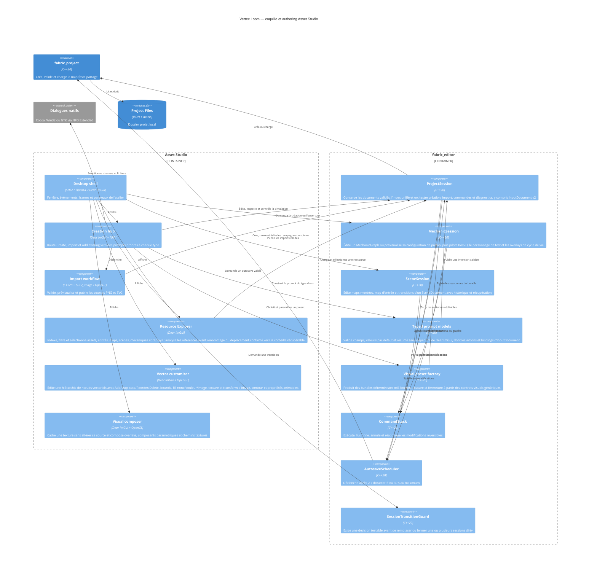

# C4 Component — coquilles Asset Studio et Map Studio

## Contract

- Le chemin peut être fourni au démarrage ; les actions interactives utilisent
  le sélecteur natif de dossier ou de fichier.
- Asset Studio et Map Studio routent toute fermeture par
  `SessionTransitionGuard`. Map Studio agrège le dirty de sa map et de sa
  mécanique ouverte, nomme les documents concernés dans la modale et ne quitte
  après `Save and continue` que si chaque sauvegarde demandée réussit.
- Le harnais CTest de Map Studio lance la coquille SDL/OpenGL cachée avec une
  copie temporaire d'un projet valide. Il injecte séparément
  `SDL_WINDOWEVENT_CLOSE` et `SDL_QUIT`, exige l'ouverture de la modale, puis
  vérifie que Cancel conserve le document principal et l'autosave. Son scénario
  d'échec empêche atomiquement le remplacement du document, vérifie que la
  session reste dirty et restaure le principal avant de quitter par Discard.
- Dans un projet Asset Studio déjà ouvert, sélectionner, créer ou importer
  appelle une transition de document unique dans `ProjectSession`. Le document
  dirty valide est sauvegardé, puis l'intention continue sans demander une
  action Save séparée ; un échec conserve la sélection et l'historique actifs.
- `MechanicSession` applique la même sauvegarde automatique avant de créer ou
  d'ouvrir un autre graphe, y compris lors de l'ouverture d'une configuration
  de prefab ou d'instance.
- `MapSession` sauvegarde également la map dirty avant de créer ou d’ouvrir une
  autre map ; une cible invalide est chargée et validée avant de toucher à la
  session courante.
- Les principales actions désactivées de Map Studio exposent désormais leur
  précondition au survol (sélection, identifiant manquant, couche active,
  historique, référence d’événement ou minimum géométrique) ; les contrôles
  secondaires d’Asset Studio restent à harmoniser.
- `SceneSession` applique le même shell de document aux scènes. Map Studio
  expose création et ouverture, références de maps avec mount stable, map
  d'entrée, transitions événementielles, undo/redo, autosave, récupération,
  validation et publication d'une campagne portable.
- La création demande un nom et un dossier parent existant. Le dossier projet
  final est calculé comme `<parent>/<identifiant-généré>` et doit être absent ou
  vide ; le dossier parent peut contenir d'autres fichiers.
  L’identifiant interne est généré depuis le nom et rendu unique sans saisie
  utilisateur. Son modèle typé porte unités monde,
  `pixelsPerUnit`, preset d’échelle, erreurs par champ, destination exacte et
  résumé avant publication.
- `Create`, `Import` et `Add existing` sont trois intentions distinctes. Chaque
  type possède son état et sa validation ; annuler ne modifie aucun document.
- Le hub affiche séparément `Create`, `Import` et `Add existing`. Projet,
  artwork et chaque source d’import possèdent un état isolé. `Add existing`
  ouvre un sélecteur des ressources déjà indexées et ne publie aucun document.
- Le menu `File > Create` expose les mêmes intentions que le hub pour les
  presets, compositions, composants, matériaux, entités, animations, bindings
  d’entrée et ressources existantes ; chaque entrée route vers son prompt ou
  sélecteur dédié.
  Les actions matériau, entité et animation utilisent leurs prompts typés et
  publient des documents validés avant réindexation.
- Le rail droit liste les ressources réellement présentes, conserve une
  sélection explicite et n'affiche pas de faux nœuds de dossier interactifs.
  L'index est reconstruit à l'ouverture et après publication ; sélectionner
  recharge le document validé et son aperçu depuis le projet.
- Le rail droit du Resource Explorer regroupe dossiers logiques, recherche,
  filtre de type et actions contextuelles. Une duplication conserve les
  dépendances partagées et génère un identifiant et un chemin uniques. Rename
  ne modifie que le nom visible. Delete analyse d'abord toutes les références
  entrantes, refuse une rupture, exige confirmation puis déplace uniquement le
  document dans `.vertex-loom-trash`; Undo le restaure sans supprimer les
  sources PNG ou SVG partagées.
- Les rails Project et Inspector d’Asset Studio sont séparés du preview par
  deux splitters `left-panel-splitter` et `right-panel-splitter`, bornés pour
  préserver une zone centrale minimale et redimensionnables au glisser.
- Les actions principales désactivées d’Asset Studio expliquent désormais leur
  précondition au survol pour les remplacements, suppressions, renommages,
  créations de comportements et transformations, ainsi que la pose de clés
  d’animation, les segments, le copier-coller de clés et les modales projet.
  Les propriétés verrouillées d’un nœud et l’ouverture d’un artwork absent
  exposent aussi leur raison ; les contrôles d’édition plus fins restent à
  harmoniser. Les actions `Undo`, `Redo`, suppression de point et ajout de
  ressource indiquent également leur précondition.
- Les actions `Import` des prompts PNG et SVG indiquent aussi leur précondition
  lorsqu’une source lisible ou un nom de ressource valide manque.
- Le panneau de diagnostics associe chaque erreur à son champ, sa cause, la
  contrainte attendue et une action corrective dérivée de `ErrorCode`.
- Le picker typé affiche systématiquement le type, le chemin, les dimensions et
  le format (ou `n/a` lorsqu’ils ne s’appliquent pas), les références entrantes
  et l’action d’ouverture dans le Resource Explorer.
- Toute référence dont le contrat correspond à un type du registre (texture,
  vector, material, entity, animation, input, behavior, transformation,
  texturedPath, visualComposition, visualComponent, map, scene, mechanic,
  replay ou audio) passe par ce picker ; seuls les types de contrat inconnus
  restent des champs texte diagnostiqués.
- La création de prefab dans Map Studio sélectionne désormais l’entité et la
  mécanique via les pickers de ressources ; seul l’identifiant du nouveau
  prefab est une saisie d’auteur.
- Les pickers de documents de Map Studio affichent également le type, le chemin,
  la taille en octets et indiquent explicitement lorsqu’une miniature ne
  s’applique pas ; leur action `Open` ouvre le document sélectionné sur disque.
- Le hub de création sépare maintenant `New material / fill` des imports et
  artworks. Le prompt produit un `MaterialDefinition v1` validé, publié
  atomiquement dans `assets/materials` puis réindexé comme ressource
  sélectionnable.
- Les prompts Behavior, Transformation, preset visuel, composition, composant,
  matériau, entité, animation et input réutilisent le même composant de
  formulaire pour leur nom ; l’éditeur de matériau réutilise aussi ce champ
  lors de l’édition, avec des clés ImGui stables.
- Les prompts artwork et entité affichent explicitement les unités de leurs
  dimensions, positions, échelles, rotations et ordre Z ; les valeurs stockées
  restent inchangées.
- Map Studio applique la même convention aux transforms, à la grille et aux
  formes de collision ; les temps de preview sont affichés en secondes.
- Les champs numériques de plateforme et de preview de personnage indiquent
  désormais aussi leur unité ou leur nature (`world units`, `degrees`,
  `world units/s`, `force` ou `coefficient`).
- Les contrôles techniques d’IK et d’animation indiquent également leur
  domaine (`iterations`, `world units`, `seconds`, unités de propriété ou
  canaux couleur) et exposent une explication au survol.
- Les valeurs numériques dynamiques des propriétés de mécanique et de
  comportement indiquent qu’elles utilisent les unités déclarées par leur
  schéma et expliquent ce domaine au survol.
- Les paramètres image et stroke des drawables, ainsi que les champs principaux
  de timeline, expliquent leur effet technique au survol.
- Map Studio expose la même aide contextuelle pour les transforms, la grille,
  les plateformes de preview et les paramètres de collision.
- Les chemins texturés et les marqueurs/segments d’animation disposent aussi
  d’une aide contextuelle sur leurs paramètres techniques.
- Les réglages de matériau, contraintes et bindings d’input exposent également
  une explication de leurs paramètres numériques.
- Les prompts de projet, artwork, matériau, entité, animation et input calculent
  leur validation avant le rendu des champs : le premier champ invalide reçoit
  le focus clavier et le scroll s’y repositionne une seule fois par erreur.
- Le drag-and-drop d’artwork du Resource Explorer ne propose comme sources que
  les textures, vectoriels et composants visuels ; les cibles racine, enfant et
  nœud existant indiquent leur rôle dans la hiérarchie.
- Les connexions du graphe mécanique sélectionnent leurs nœuds puis leurs ports
  typés dans les listes du nœud choisi, avec recherche et état explicite des
  références absentes ; les ports de sortie et d'entrée sont filtrés selon le
  côté de la connexion.
- L’inspecteur Asset Studio l’applique aussi aux UV et aux vues raster ; les
  facteurs, coordonnées normalisées, pixels et unités monde sont distingués.
- Les propriétés techniques de transform, bounds et ordre Z affichent un
  tooltip d’aide sur leur unité ou leur effet de rendu. Les transforms de
  matériau, de composition, de raster et de chemin exposent également leur
  sémantique d’édition au survol.
- L'inspecteur de matériau réutilise ce même contrat pour éditer nom, couleur,
  opacité, blend, texture, motif vectoriel et transform UV. Chaque mutation
  validée passe par le `CommandStack`; sauvegarde, autosave et récupération
  utilisent le chemin du document sélectionné, et les entités entrantes sont
  affichées sans état de sélection implicite.
- Le hub propose aussi `New entity...`. Le prompt crée un nœud racine avec
  drawable, matériau optionnel et transform, valide les références locales,
  publie atomiquement dans `entities`, puis réindexe l’entité.
- Les champs du prompt d’entité (nom de nœud, transform et ordre Z) et du prompt
  d’animation (durée, boucle et marker) sont conservés lors de la publication,
  avec un round-trip couvert par `creation prompt fields survive entity and
  animation publication`.
- Le Resource Explorer analyse les références entrantes avant suppression et
  permet de choisir une ressource de remplacement du même type. Les documents
  entrants sont validés avant publication et la suppression reste bloquée si
  des références subsistent.
- Le hub propose `New animation...`. Le prompt crée un `AnimationClip v3`
  avec cible d'entité explicite ou mode générique, durée, boucle et marker
  optionnel, le publie atomiquement dans
  `assets/animations`, puis le réindexe sans imposer de piste métier.
- Le hub propose `New input bindings...`. Le prompt édite le nom, les actions
  et les couples périphérique/code, refuse les identifiants et bindings
  dupliqués, capture une touche ou un bouton SDL et publie atomiquement `InputDocument v2` sous
  `assets/input/<id>.input.json`, puis le réindexe et le sélectionne. Les
  `AudioDocument` sont également indexés sous `assets/audio` dans le rail.
- L’inspecteur audio affiche et édite les événements chargés (source, volume,
  boucle) via une publication atomique validée, avec diagnostics de parsing.
- L’inspecteur d’un input existant permet de modifier les identifiants d’action,
  les périphériques et les codes, d’ajouter ou supprimer des actions et des
  bindings, puis de sauvegarder avec `CommandStack`, undo/redo et autosave
  validé. Chaque action affiche aussi les `BehaviorGraph` qui la consomment
  via un nœud `action_source` et sa propriété `semantic_id`.
- L’inspecteur d’entité liste les nœuds dans leur ordre stable et permet de
  modifier nom, parent, ordre, transform, visibilité, verrouillage et drawable
  complet. Kind, artwork, matériau, variante, ancre et overrides utilisent les
  ressources indexées plutôt que des identifiants implicites. Chaque mutation passe par
  `CommandStack`, reste undoable et ne peut pas introduire de cycle ou de
  transform non fini.
- Si un changement de drawable rend les overrides d’un `VisualComponent`
  incompatibles, l’inspecteur demande confirmation et indique leur nombre ;
  l’annulation conserve le composant, et la confirmation passe par la même
  commande de nœud.
- Le canvas d’entité affiche un gizmo de translation pour le nœud sélectionné ;
  un drag convertit le delta écran en unités monde et passe par
  `set_selected_entity_node`. Les nœuds verrouillés restent non éditables ;
  le parcours `asset_studio_entity_e2e` injecte désormais ce drag SDL puis
  vérifie la position après sauvegarde et reload. Les widgets de l’arbre et les
  cibles de drop utilisent l’identifiant persistant du nœud, pas sa position
  courante dans le tableau ; le même contrat s’applique à l’arbre vectoriel.
- Le Resource Explorer expose un payload ImGui typé `VERTEX_LOOM_RESOURCE` pour
  les textures, vecteurs et composants visuels. L’inspecteur accepte ce payload
  sur un nœud existant ou sur les zones de création d’un nœud racine ou enfant,
  puis applique la mutation via `ProjectSession`. Un composant visuel portant
  des overrides est refusé par ce chemin tant que la confirmation de perte n’est
  pas explicitement réutilisée.
- Les modes E2E SDL écrivent, en cas d’échec, un rapport de diagnostics et une
  capture PPM du framebuffer dans le projet de test pour rendre l’échec
  reproductible et inspectable.
- Le mode `asset_studio --ui-test <projet>` rend une frame puis produit
  `asset-studio-ui-widgets.json`, un registre versionné des clés stables des
  lignes de ressources et des nœuds d’entité.
- La duplication de ressources accepte des dépendances explicitement choisies :
  elles sont clonées avec un nouvel identifiant avant la ressource principale,
  puis seules les références de type et d’identifiant correspondants sont
  réécrites. Les autres références restent partagées.
- Il permet aussi d’ajouter un nœud racine ou enfant, de dupliquer un nœud et
  de supprimer un nœud feuille. Les identifiants générés sont uniques ; une
  suppression d’un parent ayant encore des enfants est refusée.
- Les sections avancées de l’inspecteur éditent désormais les contraintes de
  transformation, chaînes IK, maillage de déformation, système XPBD et machine
  d’états de l’entité. Chaque sauvegarde remplace l’`EntityDefinition` dans
  `ProjectSession`, passe la validation du contrat et reste undoable.
- Les références source/cible des contraintes et des chaînes IK utilisent un
  sélecteur de nœud typé avec recherche et état manquant, plutôt qu’un ID libre.
- Les propriétés `ResourceReference` des BehaviorGraph utilisent le même picker
  typé pour les contrats connus et conservent la saisie libre uniquement pour
  les types de ressource encore inconnus.
- Les extrémités des connexions BehaviorGraph sélectionnent désormais un nœud
  existant par ID/type via un picker recherchable ; les ports sont sélectionnés
  dans la liste typée du nœud choisi, avec filtre entrée/sortie.
- Map Studio applique le même principe aux connexions de `MechanicGraph` : les
  nœuds source et cible sont sélectionnés dans la liste typée et recherchable,
  puis leurs ports sont sélectionnés dans les listes filtrées par direction et
  affichent leur type.
- L’inspecteur d’animation permet d’insérer des clés `Vec2`, scalaires,
  couleurs, booléens ou références de ressources, puis réutilise le même
  historique et le même parseur strict pour les évaluer et les sauvegarder.
  Des presets de binding transform/material/fill/image-fill accélèrent la
  création sans supprimer le mode `Custom`. Le sélecteur typé dérive les
  propriétés de transform, matériau, fill et image-fill de l’entité cible ; le
  composant et la propriété sont choisis dans les descripteurs de l’entité ou
  du composant visuel, sans saisie d’ID libre ; le
  scrubber affiche chaque valeur évaluée,
  son binding et sa composition. Les clés peuvent être sélectionnées en
  groupe, copiées puis collées avec un décalage relatif ; leur temps peut être
  aimanté à un intervalle configurable avant de passer par `CommandStack`.
- Le canvas et l'inspecteur dérivent uniquement de la sélection courante. Les
  réglages du manifeste vivent dans une fenêtre `Project settings` distincte.
- Ouvrir, créer, fermer ou quitter avec un document dirty demande `Save`,
  `Discard` ou `Cancel` avant de remplacer la session.
  `Cancel` et un échec de `Save` conservent la session et son historique ;
  `Discard` n'abandonne l'état courant que si l'action suivante aboutit.
- L’assistant d’artwork valide taille de travail, origine, unités, première
  forme et fill ; il résout seul les conflits d’identifiant. Un fill image référence une texture
  locale et expose cadrage, offset, rotation, échelle, opacité et suivi de la
  déformation. La confirmation publie un `VectorAsset v2 native` atomique.
- Une ouverture échouée expose les erreurs structurées et ne remplace pas la
  dernière session valide.
- SDL2 possède la fenêtre et les événements ; Dear ImGui possède uniquement
  l'interface d'outil ; OpenGL efface et présente la surface.
- Un import réussi conserve le `TextureAsset` et les pixels décodés pour
  l'aperçu ; un échec conserve le dernier import réussi.
- Un import PNG ou SVG décode et présente d'abord un aperçu temporaire. La
  publication ne se produit qu'après confirmation de l'utilisateur.
  Annuler libère cet aperçu et ne modifie ni la sélection ni les fichiers du
  projet. Les fills image choisissent une texture indexée par son nom visible.
- Un import SVG réussi conserve le `VectorAsset` et son aperçu RGBA8 borné ;
  un échec conserve le dernier import vectoriel réussi.
- Asset Studio n’expose aucun import sprite ; PNG alimente les textures et SVG
  les ressources vectorielles liées conformément à ADR-0025.
- Une texture importée reste immuable. Le composer stocke une vue de crop en
  pixels source et des calques séparés ; aucune action de cadrage ne réécrit le
  PNG ou ne convertit implicitement son contenu en géométrie.
- Les yeux, boutons, fermetures, coutures et effets similaires sont des
  instances de composants paramétriques ancrées à la composition. Leur rendu,
  leurs propriétés animables et leur ordre de profondeur sont prévisualisés
  avec les mêmes draw packets que le runtime.
- La factory de presets ne produit aucun type de rendu dédié. Elle assemble
  uniquement `VectorAsset`, `TexturedPath`, `VisualComposition` et
  `VisualComponent`. Une fermeture possède deux rails, des instances de dent
  et un curseur transformable ; son futur suivi de rail restera une contrainte
  générique de composition.
- `ProjectSession` indexe et sélectionne aussi les chemins texturés,
  compositions et composants. Asset Studio expose la factory par un prompt
  typé qui choisit le preset, la texture de fil et le nombre borné de dents,
  puis sélectionne le composant publié.
- Le resolver visuel partagé charge récursivement une composition ou un
  composant, applique paramètres, transforms, opacité et ordre Z stable, refuse
  les cycles de composants et produit des `VectorDrawPacket` avec leurs bounds.
  Asset Studio et le runtime consomment ce même résultat.
- Lorsqu'une timeline cible un paramètre de composant, le resolver partagé
  compose l'évaluation générique avec les valeurs défaut, variante et instance
  avant de reconstruire les mêmes packets. Asset Studio, Map Studio et Preview
  Runtime ne traduisent donc pas eux-mêmes les paramètres visuels animés.
- Une entité v4 peut instancier un `VisualComponent` avec variante, ancre et
  overrides typés. La session et le runtime appliquent ensuite le transform de
  nœud aux paquets résolus, sans connaître le preset d'origine.
- `ProjectSession` porte aussi les modifications de `VisualComposition` et
  `VisualComponent` dans le `CommandStack`. Asset Studio édite les calques,
  transforms, ordre Z, visibilité, ancrages et paramètres avec le même flux
  undo/redo, autosave, récupération et sauvegarde atomique que les entités.
  La création générique publie une composition vide puis, séparément, un
  composant réutilisable qui la référence ; l'ajout de calque choisit toujours
  une ressource déjà indexée et typée.
- La timeline peut sélectionner un `VisualComponent` indexé, enregistrer ses
  `PropertyDescriptor` animables dans le registre et produire un binding
  `node + component + property`. Les paramètres de Beam, couture ou fermeture
  utilisent ainsi les mêmes pistes scalaire, `Vec2` et couleur que les autres
  propriétés, sans type de piste propre au preset.
- Un chemin texturé conserve sa courbe et ses paramètres de répétition. Sa
  géométrie de ruban est dérivée pour le rendu et n'est ni la source de la
  texture, ni une collision implicite.
- `ProjectSession` édite aussi le document `TexturedPath` complet par commande
  réversible et lui applique autosave, récupération et sauvegarde atomique.
  L'inspecteur expose points d'attache, segments ligne/Bézier, poignées,
  largeur, UV, teinte et opacité. La preview dérive le ruban depuis l'état en
  mémoire et peut faire défiler l'offset UV sans persister une animation
  spéciale.
- Toute mutation d’un document éditable passe par `CommandStack`. Les imports,
  qui créent des ressources immuables sans remplacement, restent hors de cet
  historique de document.
- La tranche native intégrée rend rectangles et ellipses, cadre le document,
  zoome sous le curseur, permet le pan et affiche une grille adaptative en
  unités monde. L'inspecteur sélectionne et édite un nœud :
  nom, visibilité, verrouillage, parent, clip, transform, couleur et paramètres
  de fill image. Les sélecteurs parent et clip proposent uniquement les autres
  nœuds du document ; la validation de session refuse ensuite les cycles ou
  références invalides.
- Le canvas natif expose les outils déplacement, rotation, échelle et pivot.
  Les poignées de rotation, d’échelle et de pivot sont dessinées autour du
  nœud sélectionné ; un geste continu est fusionné par `CommandStack` en une
  seule mutation undoable. Le déplacement du pivot compense la position afin
  de ne pas déplacer visuellement la forme.
- Le canvas natif envoie les draw packets validés au backend OpenGL 3 dans le
  viewport courant. Le resolver charge à la demande les `TextureAsset` locaux,
  les met en cache GPU pendant la session et les fournit au sampler image ; le
  fallback ImGui reste disponible si une texture ne peut pas être résolue.
- Les formes `line` et `path` sont des géométries natives. Un chemin conserve
  ses commandes `move`, `line`, `cubic` et `close`; son aperçu aplatit les
  Bézier en mémoire sans persister une rasterisation.
- Le passage d’une primitive `rectangle`, `ellipse` ou `line` vers `path`
  conserve sa géométrie via `path_commands_from_shape`; les formes dégénérées
  restent refusées et aucune conversion destructive n’est effectuée.
- Les commandes de path sont insérées ou retirées par des opérations validées :
  la commande `move` reste en tête et un path conserve au moins un segment.
  L’inspecteur propose l’ajout de segments sans exposer une mutation JSON
  directe.
- Le personnalisateur expose ces points, commandes et deux poignées Bézier dans
  l'inspecteur de nœud, avec validation et CommandStack. Sur un path
  sélectionné, le canvas rend les ancres et poignées, convertit leurs
  déplacements écran en coordonnées locales et les persiste par la session ;
  la sélection multiple et les trois modes de poignées suivent le même
  CommandStack.
- Le scénario CTest `asset_studio_vector_e2e` rejoue cette édition sur la
  fixture textile : conversion en path, déplacement d’une poignée, undo/redo,
  sauvegarde, reload et validation du projet.
- Un nœud peut conserver un contour avec couleur, largeur, jointure et
  extrémité ; les nœuds sont composés dans l’ordre stable de `native.nodes`.
- Les nœuds natifs peuvent référencer un parent et un clip par identifiants
  locaux ; le validateur refuse les références manquantes et les cycles avant
  publication. Le renderer OpenGL construit une chaîne stencil par niveau pour
  afficher les clips imbriqués ; les cycles et références absentes produisent
  un diagnostic sans dessiner le packet invalide.
- Un seul document porte des changements à la fois. Changer de ressource avec
  un vecteur dirty est refusé jusqu'à Save ou Undo ; les historiques propres
  sont neutralisés avant de changer de document.
- La session expose undo, redo et dirty et ne marque clean qu’après une
  sauvegarde principale réussie.
- Save et autosave ciblent le document actif : `project.json` pour les réglages
  projet, le document `VectorAsset` ou le document `EntityDefinition` sélectionné
  pour l'édition.
- `CommandStack::execute` accepte une commande possédée par la pile ;
  `can_undo`, `can_redo`, `undo`, `redo`, `mark_clean` et `dirty` exposent son
  état sans dépendance à Dear ImGui.
- Une récupération plus récente est proposée à l’ouverture ; accepter charge
  son contenu en mémoire, refuser conserve le principal, sans écriture implicite.
- Les raccourcis affichent et utilisent `Cmd` sur macOS et `Ctrl` sur Windows
  et Linux. Ils restent inactifs lorsqu'une modale requiert une décision.
- Map Studio expose ces commandes dans sa barre `File/Edit/Help` et affiche
  l’aide de `F`, `Home`, duplication, déplacement, sauvegarde, historique et
  fermeture à côté des raccourcis clavier.
- Les fenêtres Asset Studio et Map Studio imposent respectivement une taille
  minimale de `900×600` et `960×640` afin de préserver leurs panneaux et leur
  navigation.
- Les deux contextes Dear ImGui activent la navigation clavier et désactivent
  le fichier d’état local pour conserver des IDs et un parcours reproductibles.
- Le manifeste constitue le premier document éditable intégré : son nom et ses
  unités passent par commandes, Save remplace `project.json`, et son autosave
  sert de preuve headless du flux commun avant les futurs documents d’asset.
- Les entités sélectionnées utilisent le même flux headless : édition de nœud,
  undo/redo, sauvegarde atomique, autosave miroir et récupération validée.
- Le viewport d’une entité résout les drawables vectoriels et texturés, compose
  les transforms parent/enfant et applique le matériau avant d’envoyer les
  draw packets au renderer OpenGL. Les textures locales sont résolues par le
  même cache GPU que les artworks natifs.
- Map Studio demande à `fabric_render` les draw packets headless de la map à
  son temps de preview. Le résolveur charge entités, drawables, composants et
  animations, applique les transforms d'instance et l'ordre calque/Z ; le
  canvas les transmet au même backend OpenGL et conserve les overlays ImGui
  de sélection, collisions et triggers.
- Map Studio sépare désormais l’édition des calques et le contenu de la carte
  dans deux `BeginChild` nommés (`map-layers-pane` et
  `map-selection-pane`). Le second panneau suit la sélection courante tandis
  que le premier conserve la hiérarchie et les actions de calque.
- Les formulaires de création et d'ouverture de Map Studio associent les
  erreurs de validation à leur champ et affichent une correction actionnable ;
  les boutons désactivés exposent la condition qui manque dans leur tooltip.
- Les références d’événements de plateforme et de prefabs dans Map Studio
  utilisent maintenant un picker d’identifiants recherchable, avec état explicite
  lorsqu’une référence existante n’est plus disponible.
- Les pickers de documents par suffixe de Map Studio affichent le type, le
  chemin et une action `Open` qui délègue l’ouverture au système.
- Asset Studio expose un parcours SDL caché de texture qui importe une source,
  persiste son crop non destructif avant de créer une autre ressource, puis
  revalide le projet publié.
- L’inspecteur d’animation propose une commande A→B qui crée ou remplace deux
  clés de même type dans une seule opération de timeline undoable ; les temps
  doivent être strictement ordonnés et le clip est revalidé avant publication.
- Map Studio liste les `MechanicGraph` du projet et ouvre un seul graphe à la
  fois dans `MechanicSession`. L'inspecteur peut ajouter ou retirer un nœud
  depuis les sept schémas intégrés, modifier ses propriétés typées et connecter
  deux ports compatibles. Undo/redo, autosave, récupération et sauvegarde
  atomique s'appliquent au graphe sans modifier le document map.
- Toute mutation valide recompile le graphe contre les événements de la map et
  invalide la preview précédente. Le monde Box2D reconstruit expose les états
  de corps par identifiant de nœud ; lecture, pause, pas à `1/60 s` et reset
  restent des commandes de preview non persistantes.
- Le prompt `Rotating platform` de Map Studio produit un `MechanicGraph`
  générique avec corps, pivot, joint, moteur et source d'activation capteur ou
  événement. Taille, vitesse, direction, accélération, couple, zone
  capteur et limites optionnelles deviennent des paramètres liés du document.
  La preview permet d'injecter explicitement les signaux capteur/événement pour
  vérifier les deux modes avant qu'un personnage ne soit ajouté à la map.
  Une entité visuelle Asset Studio optionnelle est liée au corps de plateforme
  sans devenir sa collision.
- La simulation matérialise les nœuds capteur dans Box2D. L'inspecteur peut
  créer ou réinitialiser un personnage dynamique de preview, lui appliquer une
  vitesse horizontale et observer son transport par contact. Les overlays
  listent l'état actif de chaque moteur et le journal borné de ses transitions
  `begin/end`, ordonné par numéro de pas fixe.
- Map Studio crée les prefabs inline par commande et lie séparément leur
  entité et leur `MechanicGraph`. Le formulaire d'overrides est dérivé des
  paramètres du graphe chargé : identifiant, type et valeur sont validés avant
  mutation. `MechanicSession` prévisualise une copie effective du graphe avec
  ces valeurs et le transform de l'instance sélectionnée, sans rendre le
  document mécanique dirty.
- L’inspecteur d’animation expose une timeline générique : durée, boucle,
  binding `node/component/property`, interpolation, easing et insertion de
  clés `Vec2` avec tangentes optionnelles. Les clips suivent le même historique de commandes, autosave,
  récupération et sauvegarde atomique que les autres documents éditables ; les
  clés existantes peuvent être déplacées ou supprimées sauf la dernière clé
  d’une track, un scrubber évalue les propriétés à l’instant courant et les
  markers peuvent être ajoutés ou supprimés. Le mode `Auto-key at scrub time`
  transforme toute modification de valeur dans l’inspecteur en `Set key` au
  temps de scrubbing courant.
  Lorsqu’un clip est sélectionné après une entité, cette entité reste disponible
  comme cible de preview ; ses draw packets sont reconstruits avec les
  transformations évaluées au temps de scrubbing.
