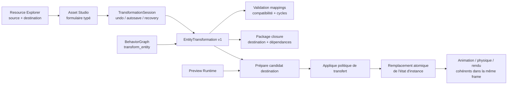

# Composants — transformation d'entité

Le candidat est détruit en cas d'erreur et l'instance source reste inchangée.
La source n'est remplacée qu'après résolution complète des ressources de la
destination et validation de chaque mapping.

`TransformationSession` refuse une mutation avant de toucher son historique si
une entité choisie est absente. Elle publie atomiquement le document principal
et conserve l'autosave comme candidat de récupération séparé.
