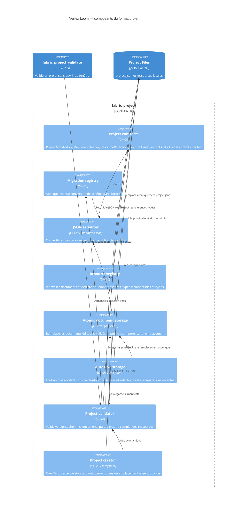

# C4 Component — format projet

## Contracts

- `ResourceId` contient 1 à 128 caractères parmi les lettres ASCII minuscules,
  chiffres, tirets, points ou underscores, avec un caractère alphanumérique aux
  deux extrémités.
- `ProjectManifest` version 2 contient le nom du projet, `pixelsPerUnit` et ses
  répertoires relatifs d'assets, d'entités, de maps, de scènes et de schémas.
- `DocumentHeader` porte la version, le type, l'identifiant et le nom communs.
  `AssetDocument` reste son alias de compatibilité.
  `TextureAsset` version 1 ajoute un chemin PNG relatif, ses dimensions et le
  format de pixels `rgba8`.
- Une texture est déclarée par `assets/textures/<id>.texture.json` et sa source
  normalisée est `assets/textures/<id>.png`. Le document JSON est le marqueur
  de publication : une source sans document n'est pas un asset chargeable.
- `VectorAsset v1` déclare actuellement une source normalisée
  `assets/vectors/<id>.svg`. Sa migration v2 conserve cette source et la marque
  `sourceKind = linkedSvg` sans modifier ses octets.
- `VectorAsset v2` devient le contrat cible. `sourceKind = native` porte des
  nœuds stables, formes, fills, contours, clips et transforms ;
  `sourceKind = linkedSvg` conserve les imports opaques compatibles.
- Le contrat hérité `SpriteSheetDefinition v1` déclare
  `assets/textures/<id>.sprite.json`, conserve
  sa source sous `<id>.aseprite` ou `<id>.source.png` et référence l’atlas
  `<id>.atlas.png`. Le document contient frames, durées, pivots, tags, slices
  et provenance. Il reste chargeable mais n’est requis par aucun nouveau
  document ni par le runtime cible.
- Les chemins absolus, vides, traversants ou extérieurs au dossier projet sont
  refusés avant tout accès aux ressources, y compris après résolution des liens
  symboliques.
- Le chargeur refuse les versions de schéma non prises en charge.
- Le format prototype `v0` (`projectId`, `displayName`, `assetsPath`) migre vers
  `v1`, puis `v1` migre vers `v2` avec `pixelsPerUnit = 100`. Les anciens
  formats sont acceptés en lecture uniquement.
- La sauvegarde valide le manifeste avant de créer un fichier temporaire dans
  le dossier projet, puis remplace `project.json` par renommage atomique.
- La création refuse un emplacement existant non vide et ne remplace aucun
  fichier. Elle crée les répertoires déclarés avant la sauvegarde atomique du
  manifeste.
- Le validateur headless inspecte chaque document `*.texture.json` et refuse
  une source manquante, extérieure au projet ou incohérente avec le contrat.
- Le validateur headless applique les contrôles propres à `linkedSvg` ou
  `native` après migration de chaque `*.vector.json`.
- Pour compatibilité, le validateur charge aussi chaque `*.sprite.json`, contrôle sa
  source, son atlas PNG, ses rectangles et toutes ses plages de frames.
- Après chargement, le validateur headless refuse les identifiants dupliqués,
  références manquantes, types incompatibles et cycles du registre.
- `ResourceRegistry` est instancié par chargement de projet, sans singleton ;
  `register_resource`, `resolve` et `validate` restent utilisables dans les
  tests et futurs chargeurs sans interface graphique.
- Un document éditable est validé par son parseur avant remplacement atomique.
  Les imports continuent à utiliser une publication séparée sans remplacement.
- `save_document_atomic` reçoit le chemin projet relatif, le document sérialisé
  et son validateur ; il crée uniquement des parents résolus dans le projet.
- Un autosave reproduit le chemin relatif du document sous
  `.vertex-loom/autosave/`. Il est récupérable seulement s’il est valide et
  strictement plus récent que le principal ; sa lecture ne modifie aucun
  fichier.
- Le stockage refuse les documents de plus de 256 Mio et les autosaves résolus
  hors du projet avant de charger leur contenu.
