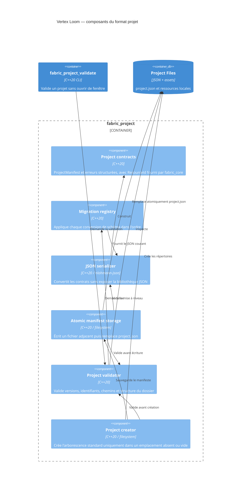

# C4 Component — format projet

## Contracts

- `ResourceId` contient 1 à 128 caractères parmi les lettres ASCII minuscules,
  chiffres, tirets, points ou underscores, avec un caractère alphanumérique aux
  deux extrémités.
- `ProjectManifest` version 1 contient le nom du projet et ses répertoires
  relatifs d'assets, d'entités, de maps, de scènes et de schémas.
- Les chemins absolus, vides, traversants ou extérieurs au dossier projet sont
  refusés avant tout accès aux ressources, y compris après résolution des liens
  symboliques.
- Le chargeur refuse les versions de schéma non prises en charge.
- Le format prototype `v0` (`projectId`, `displayName`, `assetsPath`) est migré
  explicitement vers `v1`; ce format legacy est accepté en lecture uniquement.
- La sauvegarde valide le manifeste avant de créer un fichier temporaire dans
  le dossier projet, puis remplace `project.json` par renommage atomique.
- La création refuse un emplacement existant non vide et ne remplace aucun
  fichier. Elle crée les répertoires déclarés avant la sauvegarde atomique du
  manifeste.
