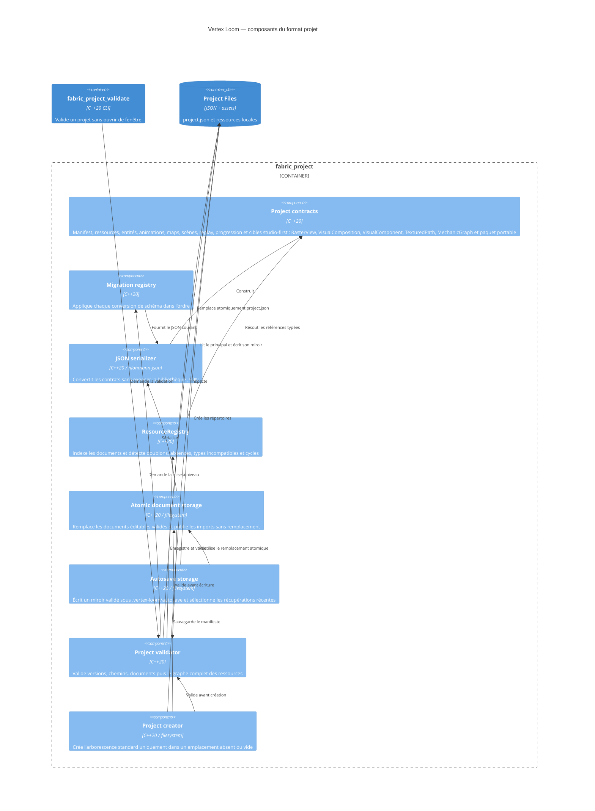

# C4 Component — format projet

## Contracts

- `ResourceId` contient 1 à 128 caractères parmi les lettres ASCII minuscules,
  chiffres, tirets, points ou underscores, avec un caractère alphanumérique aux
  deux extrémités.
- `ProjectManifest` version 2 contient le nom du projet, `pixelsPerUnit` et ses
  répertoires relatifs d’assets, d’entités, de maps, de scènes et de schémas.
- `DocumentHeader` porte la version, le type, l’identifiant et le nom communs.
  `AssetDocument` reste son alias de compatibilité.
  `InputDocument v1` est stocké sous `assets/input/<id>.input.json` et porte
  une table d’actions nommées, chacune pouvant déclarer plusieurs bindings
  clavier ou manette. Les codes sont des entiers positifs ou nuls ; les
  identifiants, périphériques et doublons sont validés avant publication.
  `TextureAsset` version 1 ajoute un chemin PNG relatif, ses dimensions et le
  format de pixels `rgba8`.
- Une texture est déclarée par `assets/textures/<id>.texture.json` et sa source
  normalisée est `assets/textures/<id>.png`. Le document JSON est le marqueur
  de publication : une source sans document n'est pas un asset chargeable.
- `RasterView v1` est une vue non destructive d'un `TextureAsset`. Elle
  conserve un rectangle de crop en pixels source, un pivot, un transform et
  le filtrage, sans posséder ni réécrire les pixels. Un champ `view` absent
  conserve la vue complète des textures historiques. `fabric_render` traduit
  cette vue en un quad, des UV et un filtre par un constructeur de draw packet
  unique consommé par Asset Studio et Preview Runtime.
- `VisualComposition v1` est stocké sous
  `assets/compositions/<id>.composition.json`. Il possède une taille monde et
  ordonne des calques raster, vectoriels, `VisualComponent` et `TexturedPath`.
  Chaque calque conserve un identifiant stable, une référence typée, un
  ancrage normalisé, son transform, sa visibilité, son opacité et son Z. Un
  calque raster peut surcharger localement la `RasterView` de sa texture.
  Les anciennes références directes à une texture resteront valides et seront
  interprétées comme une composition à un seul calque non recadré.
- `VisualComponent v1` est stocké sous
  `assets/components/<id>.component.json`. Il référence une composition
  interne et déclare bounds locaux, ancrages, paramètres typés liés à ses
  calques et variantes. Un calque composant conserve une instance avec
  variante, ancrage et overrides ; les valeurs se résolvent dans l'ordre
  défaut, variante, instance. Les paramètres compatibles avec
  `AnimationValue` sont découvrables via `PropertyDescriptorRegistry`.
- `TexturedPath v1` est stocké sous
  `assets/paths/<id>.textured-path.json`. Il conserve commandes line/cubic,
  fermeture, largeur et profil optionnel, texture, répétition ou étirement,
  échelle/offset UV, couleur, opacité, raccords et terminaisons. Le ruban et
  ses UV sont dérivés à l'exécution ; aucune collision ni géométrie
  triangulée n'est persistée par ce document.
- `MechanicGraph v1` composera corps, pivots, joints, moteurs, capteurs,
  contraintes et liaisons événementielles. Ses instances exposeront des
  paramètres typés et seront simulables dans Map Studio avant le runtime.
- `VectorAsset v2` est la version écrite. Un document v1 est accepté en lecture,
  conserve sa source `assets/vectors/<id>.svg` et devient
  `sourceKind = linkedSvg` sans modifier le fichier source.
- `sourceKind = linkedSvg` est actuellement chargeable et publiable.
  `sourceKind = native` stocke actuellement taille, origine, nœuds stables,
  visibilité, verrouillage, transform, rectangle ou ellipse et fill couleur ou
  transparent. Un fill image référence un `TextureAsset`, conserve son mode de
  cadrage, son transform indépendant, son opacité et son choix de suivre la
  déformation de la forme. Sa publication est atomique et ne crée aucun SVG.
- `MaterialDefinition v1` est stocké sous
  `assets/materials/<id>.material.json` et porte couleur, opacité, blend,
  transform UV, texture optionnelle et motif vectoriel optionnel.
- `EntityDefinition v1` est stocké sous `entities/<id>.entity.json` et porte
  des nœuds stables, parentage, transform, ordre Z, drawable vectoriel ou
  texture, matériau optionnel et contraintes d’animation ordonnées. Les
  contraintes référencent uniquement des nœuds de la même entité et sont
  validées contre les cycles, doublons d’ordre et nœuds manquants.
- `AnimationClip v1` est stocké sous
  `assets/animations/<id>.animation.json`. Il porte une durée, une boucle,
  des markers et des pistes liées par `nodeId + componentId + propertyId`.
  Les valeurs v1 sont scalaire, `Vec2`, couleur, booléen ou référence de
  ressource ; les interpolations disponibles sont step, linear et cubic.
  Chaque piste porte aussi une composition `replace` ou `additive` ; le champ
  est facultatif à la lecture pour conserver la compatibilité des clips v1
  existants et vaut `replace` par défaut. L’évaluation headless expose cette
  composition avec la valeur interpolée. Le helper `animation_markers_between`
  et l’API runtime correspondante renvoient les markers franchis dans
  l’intervalle semi-ouvert `(from, to]` (`from < marker <= to`), avec
  instant absolu, instant local et index de boucle.
- `PreviewRuntime` énumère les documents `*.animation.json` sous
  `assets/animations` avant l’initialisation SDL. Chaque document est chargé
  avec un chemin relatif au projet, validé puis indexé par `ResourceId` ; un
  document invalide empêche le chargement du runtime. L’évaluation headless
  d’un clip est disponible par identifiant et instant. Une instance de map peut
  le sélectionner via la propriété `animation`, directement ou par override de
  prefab ; le runtime applique alors les pistes de transformation et de
  matériau supportées ; les pistes additives de position, rotation, échelle,
  couleur et opacité sont appliquées comme offsets sur la pose ou le matériau
  de base. Les pistes `transform` sont aussi appliquées aux poses
  de déformation avant l’évaluation du maillage, avec une API headless pouvant
  évaluer à un instant donné.
- `PropertyDescriptorRegistry` décrit les propriétés exposées par les
  composants, résout les bindings stables et filtre les propriétés animables
  et inscriptibles pour les outils d’édition.
- `AnimationStateMachine` relie des clips par états et transitions. Les
  conditions booléennes/numériques, `exitTime`, priorités et références de
  clips sont validés avant sélection déterministe.
- `AnimationConstraint` porte une dépendance source/cible et un ordre explicite
  pour `copy_transform`, `limits` ou `look_at`. Les cycles et rangs dupliqués
  sont refusés avant résolution ; les bornes optionnelles de `limits` doivent
  être finies et ordonnées. Preview Runtime résout à chaque évaluation les
  pistes, puis ces contraintes et les chaînes IK avant les poses de déformation.
  Les mêmes nœuds résolus pilotent les draw packets visuels, y compris pour les
  entités sans maillage de déformation. Le résultat animation/nœuds est mis en
  cache par instance et instant de frame pour éviter les résolutions répétées.
- Les entités peuvent persister des chaînes FABRIK 2D (`ikChains`) ciblant des
  nœuds par identifiant ; le runtime les résout dans l'ordre déclaré avant de
  produire les poses et draw packets. Le solveur conserve la racine, borne ses itérations, vérifie les
  longueurs de segments et traite explicitement les cibles hors de portée.
- Une entité peut persister `animationStateMachine` ; ses états référencent des
  clips, ses transitions sont évaluées par priorité et `exitTime`, et les
  paramètres d'instance utilisent les propriétés `animationParameter.<id>`.
  `PreviewRuntime::evaluate_instance_state` expose l’état, le clip et le temps
  local effectivement sélectionnés pour l’inspection headless. Les instances
  liées directement par `animation` produisent aussi les événements de markers
  franchis à chaque pas fixe.
- `PreviewRuntime` met en cache les `VectorAsset` convertis et les résultats de
  géométrie par ressource ; chaque instance reçoit ensuite une copie mutable
  avant matériau et transformation. Les packets sont triés de façon stable par
  profondeur de couche, ordre Z du nœud, puis identifiant.
- Le système XPBD unifié expose distance, flexion, aire, pin et collision,
  conserve les lambdas, applique la compliance et quantifie l’état après
  chaque sous-pas.
- La déformation maillée applique les poses de nœuds aux sommets de repos par
  influences pondérées et valide les triangles et références de poses.
- `PreviewRuntime` charge ces simulations par instance avant SDL, expose leur
  évaluation headless et exécute XPBD à pas fixe ; l’injection des sommets
  déformés dans les draw packets est activée lorsque la topologie correspond.
  Lorsque les deux contrats sont associés, leurs sommets et particules sont
  validés en correspondance 1:1.
- `MapDocument v1` est stocké sous `maps/<id>.map.json` et sépare calques,
  prefabs, instances, collisions et triggers. Les instances sont indexées par
  chunks de `64 × 64` unités, événements nommés et les propriétés custom ont un
  ensemble de types fermé.
- Une map est la racine de publication du catalogue. Son export portable
  conservera le `MapDocument`, les ressources transitivement référencées et
  une version minimale de runtime ; les chemins absolus et dépendances non
  résolues empêcheront la publication.
- Une propriété custom d’instance nommée `animation` est réservée à la
  lecture d’un `ResourceReference` de type `animation`. Elle est unique par
  instance, validée par le parseur MapDocument et résolue par le Preview
  Runtime ; l’absence du clip référencé empêche le chargement runtime.
- Un `PrefabDefinition` est une ressource logique de type `prefab` enregistrée
  par le validateur à partir de son `MapDocument`. Son identifiant, son
  `EntityDefinition` et ses overrides sont donc vérifiés par le graphe global,
  y compris lorsqu’une instance référence le prefab.
- `MapChunkIndex` maintient un ordre déterministe par chunk et identifiant et
  extrait les instances visibles d’un viewport sans accès disque.
- `SceneDocument v1` est stocké sous `scenes/<id>.scene.json`. Il référence les
  maps de la scène, son `entryMap` et des transitions vers d’autres scènes avec
  un point d’entrée. Une transition peut porter un identifiant d’événement
  gameplay optionnel pour être sélectionnée par le runtime. Toutes ces
  références sont vérifiées par le registre global.
- `ReplayDocument v1` est stocké sous `assets/replays/<id>.replay.json`. Il
  conserve le build, la seed, les entrées et événements ordonnés par frame,
  puis les checkpoints quantifiés à `1/4096` pour les positions et `1/65536`
  de tour pour les rotations.
- `ProgressSave v1` est séparé du projet d’authoring. Il conserve le build, la
  scène active et des propriétés typées (`bool`, entier, réel, texte, `Vec2`
  ou référence de ressource), puis les écrit par remplacement atomique dans
  le chemin utilisateur fourni par le runtime.
- Les chemins absolus, vides, traversants ou extérieurs au dossier projet sont
  refusés avant tout accès aux ressources, y compris après résolution des liens
  symboliques.
- Le chargeur refuse les versions de schéma non prises en charge.
- Le format prototype `v0` (`projectId`, `displayName`, `assetsPath`) migre vers
  `v1`, puis `v1` migre vers `v2` avec `pixelsPerUnit = 100`. Les anciens
  formats sont acceptés en lecture uniquement.
- La sauvegarde valide le manifeste avant de créer un fichier temporaire dans
  le dossier projet, puis remplace `project.json` par renommage atomique.
- La création refuse un emplacement existant non vide et ne remplace aucun
  fichier. Elle crée les répertoires déclarés avant la sauvegarde atomique du
  manifeste.
- Le validateur headless inspecte chaque document `*.texture.json` et refuse
  une source manquante, extérieure au projet ou incohérente avec le contrat.
- Le validateur headless applique les contrôles propres à `linkedSvg` ou
  `native` après migration de chaque `*.vector.json`.
- Le validateur headless charge aussi les documents matériau et entité,
  enregistre leurs références typées et refuse les cycles de parentage ou de
  dépendances.
- Après chargement, le validateur headless refuse les identifiants dupliqués,
  références manquantes, types incompatibles et cycles du registre.
- `ResourceRegistry` est instancié par chargement de projet, sans singleton ;
  `register_resource`, `resolve` et `validate` restent utilisables dans les
  tests et futurs chargeurs sans interface graphique.
- Un document éditable est validé par son parseur avant remplacement atomique.
  Les imports continuent à utiliser une publication séparée sans remplacement.
- `save_document_atomic` reçoit le chemin projet relatif, le document sérialisé
  et son validateur ; il crée uniquement des parents résolus dans le projet.
- Un autosave reproduit le chemin relatif du document sous
  `.vertex-loom/autosave/`. Il est récupérable seulement s’il est valide et
  strictement plus récent que le principal ; sa lecture ne modifie aucun
  fichier.
- Le stockage refuse les documents de plus de 256 Mio et les autosaves résolus
  hors du projet avant de charger leur contenu.
