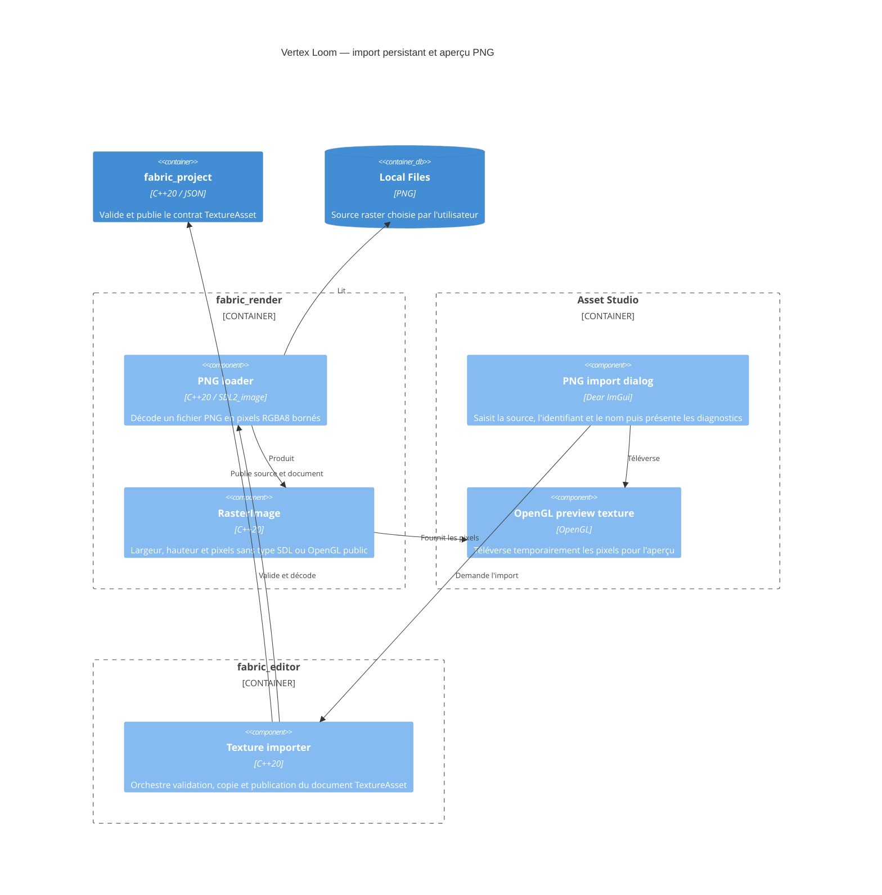

# C4 Component — import raster PNG

## Contract

- Le chargeur accepte uniquement l'extension `.png`, sans tenir compte de la
  casse, puis laisse le décodeur vérifier le contenu réel.
- La sortie publique est RGBA8, contiguë par ligne et indépendante de SDL.
- L'en-tête IHDR est contrôlé avant décodage. Une image doit mesurer entre 1 et
  16384 pixels sur chaque axe et ne pas dépasser 67108864 pixels au total.
- L'import refuse tout identifiant ou PNG invalide et ne remplace jamais un
  asset existant.
- La source est copiée vers un fichier temporaire adjacent. Après validation,
  la source finale est publiée avant le document JSON atomique ; le document
  est l'unique marqueur rendant l'asset découvrable par le runtime.
- L'aperçu GPU utilise exactement les pixels validés lors de l'import.
