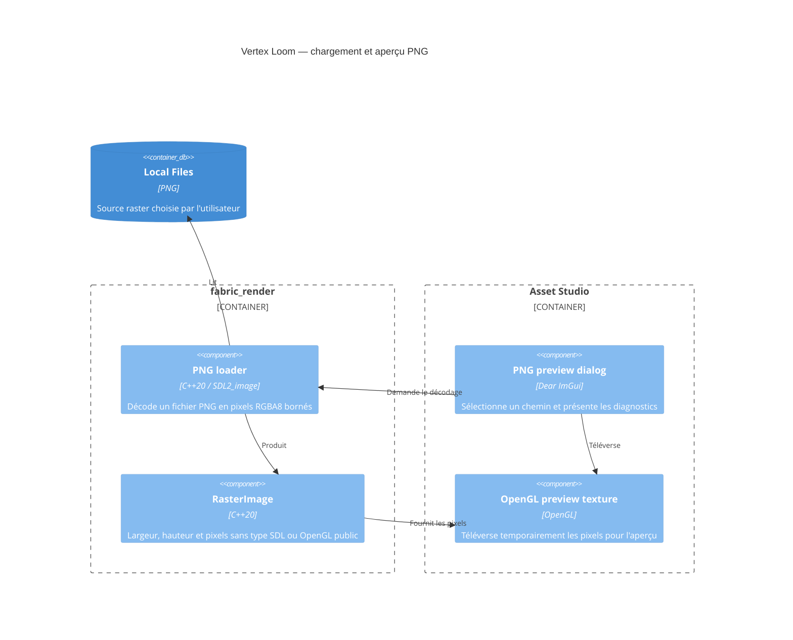

# C4 Component — aperçu raster PNG

## Contract

- Le chargeur accepte uniquement l'extension `.png`, sans tenir compte de la
  casse, puis laisse le décodeur vérifier le contenu réel.
- La sortie publique est RGBA8, contiguë par ligne et indépendante de SDL.
- L'en-tête IHDR est contrôlé avant décodage. Une image doit mesurer entre 1 et
  16384 pixels sur chaque axe et ne pas dépasser 67108864 pixels au total.
- L'aperçu GPU reste temporaire : la copie dans le projet et le document
  `TextureAsset` constituent l'incrément suivant.
