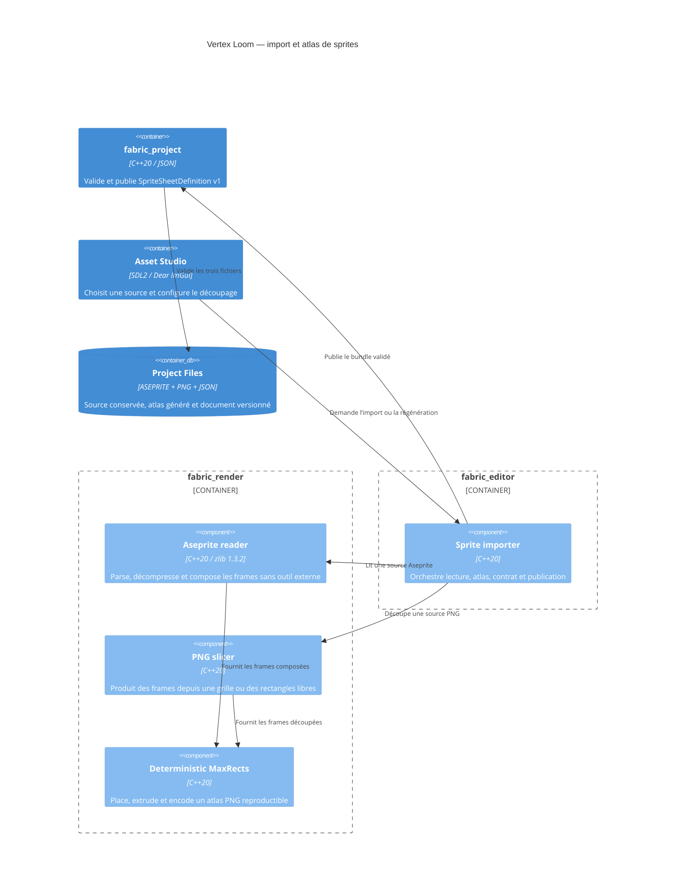

# C4 Component — import Aseprite et sprites

## Contract

- Le parseur borne la source à 256 Mio, le canvas à 16384 pixels par axe, le
  total à 67108864 pixels, le nombre de frames à 65535 et chaque allocation
  avant décompression.
- Le format est little-endian et chaque taille de frame, chunk, chaîne, palette
  et flux compressé est vérifiée avant lecture.
- Une frame Aseprite est composée à partir des calques visibles et de leurs
  groupes. Les modes de fusion autres que normal, les tilemaps, les références
  externes et les z-index non nuls sont refusés tant qu’ils ne sont pas rendus
  fidèlement.
- Les cels indexed utilisent la palette active de leur frame et l’index
  transparent du header pour les calques non background.
- Les frames liées résolvent uniquement une frame antérieure du même calque ;
  toute référence absente, future ou cyclique est refusée.
- Le packer utilise une comparaison totale indépendante des adresses et de
  l’ordre des conteneurs associatifs. Le rectangle publié exclut padding et
  extrusion.
- `SpriteSheetDefinition` référence uniquement les chemins canoniques dérivés
  de son identifiant. Le JSON est publié en dernier et marque la ressource
  chargeable.
- Chaque frame issue d’un PNG conserve aussi son rectangle `inputBounds` dans
  la source ; la grille et les frames libres sont donc régénérables sans état
  d’interface caché.
- Une régénération valide entièrement le nouvel atlas et le nouveau document,
  puis remplace chacun atomiquement avec rollback de l’atlas si le document ne
  peut pas être remplacé ; la source originale reste inchangée.

## Implementation

- `fabric/render/aseprite.hpp` expose le document décodé sans type zlib.
- `fabric_render/src/aseprite.cpp` contient le lecteur borné, la résolution des
  cels et la composition CPU déterministe.
- `fabric/render/sprite_atlas.hpp` expose découpage et génération d’atlas ;
  `fabric_render/src/sprite_atlas.cpp` porte MaxRects, extrusion et PNG.
- `fabric/project/sprite_sheet.hpp` expose `SpriteSheetDefinition v1` et
  `fabric_project/src/sprite_sheet.cpp` porte son JSON, sa publication et la
  validation complète signature/chunks/CRC/zlib de l’atlas PNG.
