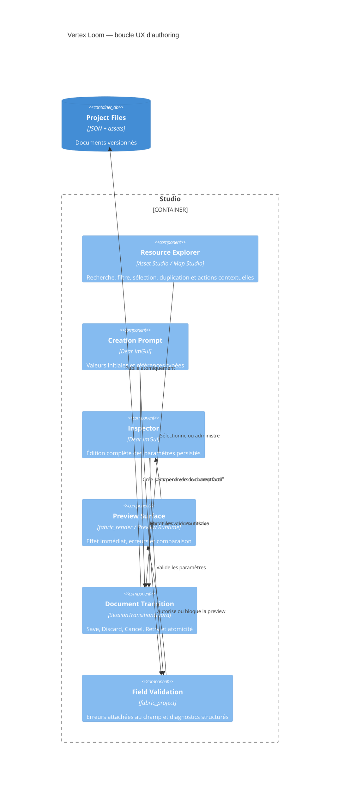
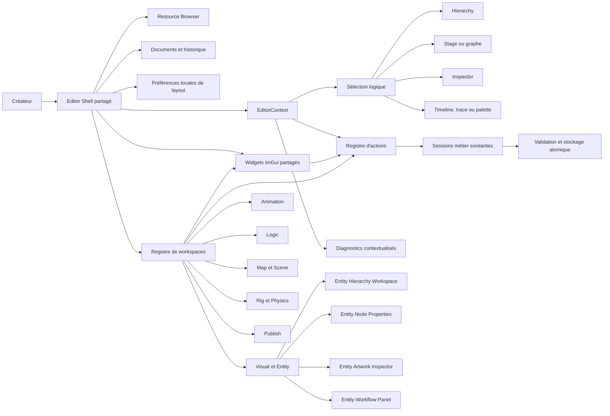
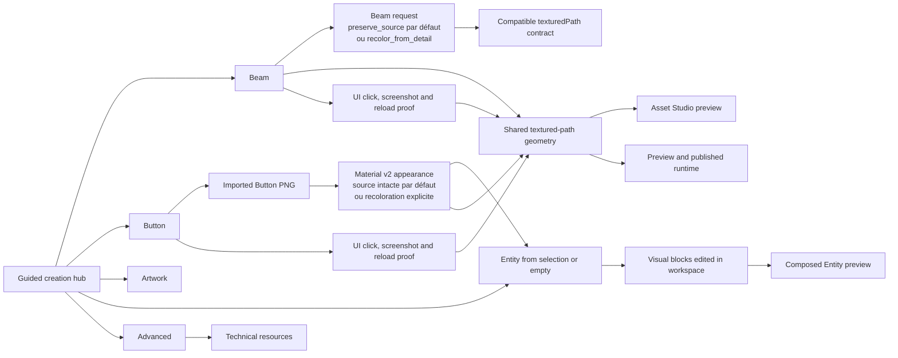

# C4 Component — parcours Studio et propriété des paramètres

## Règle de propriété des paramètres

| Surface | Responsabilité obligatoire |
| --- | --- |
| Creation Prompt | Valeur initiale, référence typée, défaut documenté |
| Resource Explorer | Découverte, contexte, chemin, type, dépendances, actions |
| Inspector | Toutes les propriétés persistées, y compris celles ajoutées après création |
| Preview | Résultat visuel/runtime et état invalide explicite |
| Validator | Erreur par champ, chemin et suggestion de correction |
| CommandStack | Undo/redo, dirty, autosave et récupération |

## Parcours nominal

1. Ouvrir/créer le projet ; afficher le rail de ressources et l'état dirty.
2. Rechercher une ressource par nom, ID ou type ; sélectionner sans saisie libre.
3. Créer ou ouvrir ; sauvegarder automatiquement le document précédent s'il est valide.
4. Régler les paramètres dans l'inspecteur ; chaque changement passe par une commande.
5. Prévisualiser immédiatement dans la même surface et corriger les erreurs au champ.
6. Composer la map/scène avec les références existantes et publier après validation.
7. Lancer Preview Runtime ; toute divergence renvoie à la ressource et au paramètre concernés.

## Workspaces orientés tâche

Le triptyque explorateur/canvas/inspecteur reste stable ; un dock inférieur
change selon la tâche. La création ne doit pas ouvrir un formulaire contenant
la totalité du futur document.

| Workspace | Sélection conservée | Canvas | Inspecteur | Dock inférieur |
| --- | --- | --- | --- | --- |
| Entity | ressource et nœud | composition, sélection directe et gizmos | propriétés du nœud ; commandes de clé | diagnostics/dépendances |
| Animation | Entity, nœud, clip et playhead | pose évaluée et gizmos auto-key | propriété ou clé sélectionnée | transport, pistes, clés, marqueurs et courbes |

Le Resource Explorer fournit `Créer une Entity depuis la sélection`. Le
workspace Entity fournit `Animate selected node…` en conservant le nœud par son
nom visible. Cette intention est une action contextuelle unique : le bouton et
la palette invoquent `animate_selection`, dont le registre calcule la
disponibilité et la raison de blocage depuis l'Entity et le nœud courants.
L'Inspector nominal présente d'abord hiérarchie, visibilité,
transform et artwork ; parentage, pivot, ordre Z, overrides et systèmes de
simulation restent dans des sections avancées fermées. Le workspace Animation
garde visibles le choix du nœud, le playhead, l'auto-key et les quatre clés de
transform. Une propriété animable fournit une icône de
clé qui crée la piste typée si nécessaire. Les paramètres de binding brut,
tangentes, composition additive et segment A→B sont avancés, jamais requis pour
la première animation. `toggle_animation_graph` partage enfin l'ouverture du
graphe entre le bouton Entity et la palette, sans seconde branche de
navigation. Voir ADR-0147 et ADR-0150.

La sélection de ressources accepte Cmd/Ctrl pour regrouper plusieurs textures,
vectoriels ou composants. Elle appartient au workspace, pas à une variable
statique cachée dans le widget. `create_entity_from_visuals`, invoquée par le
bouton, le menu contextuel et la palette, prépare alors la racine et ses blocs
enfants en une seule transition. Dans l'Entity, l'arbre récursif,
le canvas et l'inspecteur partagent une sélection primaire et un groupe. Un
drag de nœud change son parent après validation de cycle ; un drag du gizmo
déplace atomiquement tous les nœuds sélectionnés non verrouillés. Changer
d'Entity réinitialise la sélection sur sa racine afin d'éviter un index hérité.
Une référence drawable absente propose une réparation limitée au même type de
ressource et ne choisit jamais un type incompatible.

Le layout desktop conserve le triptyque existant et matérialise le dock
Timeline sous le canvas lorsqu'un clip est actif. L'action contextuelle de
l'explorateur prépare l'Entity depuis les visuels courants ; elle ne duplique ni
ne convertit les ressources sources. Le dock rend les pistes et clés sur un axe de
temps manipulable et réutilise les commandes undoables de `ProjectSession`.
La lecture, le scrub et le déplacement des clés restent des états d'interface ;
seule une commande de clé validée modifie le document.
La preuve E2E Animation doit choisir le nœud par son libellé visible puis activer
une commande de clé rapide dans l'interface,
sauvegarder, recharger et vérifier la piste typée correspondante avant de
capturer le workspace avec un contexte OpenGL réel.
La preuve transversale Entity→Animation part d'un visuel existant, clique les
actions contextuelles réelles et ne prépare aucun document Entity ou Animation
par `ProjectSession`. Le nom du clip est dérivé de la sélection visible et reste
modifiable dans la modale courte avant validation.
Le scénario continue dans le workspace Animation en cliquant `Key Position`,
`Auto-key`, le playhead puis en déplaçant le gizmo. Les deux poses persistées
doivent provenir de ces gestes et non d'un segment A→B préparé par la session.
Avant ce passage, il dépose un second visuel comme enfant de la racine. Le nœud
créé reste sélectionné et devient la cible du clip et du gizmo, ce qui couvre
composition, parentage et correction sans sélection technique intermédiaire.
Il poursuit par lecture/pause, drag du second losange et
`Add event at playhead`. Le marqueur reçoit un nom unique automatiquement ; le
volet avancé ne sert que pour son identité, son temps exact ou son cue audio.

`Animation Graph` est un panneau dédié ouvert depuis l'Entity. Il édite des
états toujours associés à un clip existant, leurs transitions, conditions,
priorités et temps de sortie, puis simule le choix déterministe avec des
paramètres éphémères. Il ne mélange pas ces paramètres de preview au document.
Son entrée nominale est un canevas auto-layouté : les cartes exposent le nom et
le clip, l'état initial est marqué, et les transitions sont des flèches. Une
palette compacte au-dessus du canevas choisit un clip puis ajoute une carte avec
un identifiant dérivé et unique. Une
commande de liaison sur la carte source suivie d'un clic sur la carte cible
ajoute une transition avec un identifiant unique. Le layout et la sélection
restent éphémères ; les états, liens et options continuent à passer par la
commande Entity existante. Les onglets `States`, `Transitions` et `Preview`
servent d'inspecteurs avancés, sans devenir obligatoires pour relier deux états.
L'ancien formulaire de state machine dans `Advanced Entity systems` est retiré
du parcours : il pouvait tenter de sauvegarder un état sans clip valide.
L'E2E du panneau et celui du gizmo Entity s'exécutent successivement afin qu'une
fenêtre au premier plan ne masque pas artificiellement l'interaction canvas.

Le volet `Entity simulation` résume le système XPBD avec les erreurs max/RMS et
l'énergie compliante définies par ADR-0139. Le canvas superpose particules et
liaisons sans les confondre avec les contraintes d'animation de nœuds ; ces
diagnostics ne sont jamais sauvegardés dans l'Entity.

Le panneau d'une ressource Audio maintient un brouillon stable du document :
bus nommés, volume, boucle et spatialisation sont édités ensemble puis validés
atomiquement. Le choix `master` reste toujours disponible et un bus supprimé
réaffecte ses événements à `master`, ce qui évite les références cassées.

`Behavior Graph` suit la même grammaire visuelle qu'Animation Graph : cartes,
ports et flèches occupent le parcours nominal ; propriétés typées, IDs et
connexion manuelle restent sous le canevas comme inspecteurs avancés. Une
palette recherchable ajoute un type de nœud avec un ID généré et unique. Une
connexion rapide part d'un port de sortie et choisit automatiquement le premier
port d'entrée compatible de la cible. L'identifiant unique est généré par
l'interface, tandis que `BehaviorSession` conserve validation, undo et dirty.

## Cible de modularisation du shell

ADR-0151 remplace l'accumulation de panneaux dans les deux points d'entrée par
une migration progressive vers un shell partagé. Cette section décrit la cible,
pas l'état actuel : tant qu'un workspace n'est pas porté, son implémentation
historique reste la surface active et ses tests continuent de s'appliquer.

| Composant | Propriétaire | Ne doit pas posséder |
| --- | --- | --- |
| Editor Shell | fenêtre, menus, onglets, navigation, layout local | document métier ou sérialisation |
| EditorContext | documents ouverts, sélection stable, workspace, historique | copie mutable d'une ressource |
| DocumentTabs | onglets, retour/avant et activation de la session par ID stable | chargement ou mutation d'une ressource |
| LayoutPreferences | mode compact/large et dimensions des panneaux dans le dossier utilisateur | ressource ou manifeste du projet |
| Map Resource Picker Adapter | énumération des documents Map/Scene/Mechanic et délégation au picker partagé | mutation du document sélectionné |
| Scene Workspace | composition de scène, transitions, validation et publication via `SceneSession` | boucle SDL, navigation globale ou seconde copie du document |
| Mechanic Workspace | graphe visuel, inspecteur, simulation et preset guidé via `MechanicSession` | boucle SDL, état E2E global ou sérialisation directe |
| Map Canvas Workspace | preview réelle, sélection, gizmos, placement, snapping et overlays physiques via `MapSession` | menus, cycle de fenêtre ou mutation hors commande |
| Entity Hierarchy Workspace | arbre parent/enfant, sélection groupée, drag/reparentage et commandes structurelles via `ProjectSession` | boucle SDL, formulaire Animation, propriétés détaillées du nœud ou sérialisation |
| Entity Node Properties | nom, verrouillage, visibilité, transform, parent, pivot et ordre Z via `ProjectSession` | artwork, matériau, overrides, hiérarchie ou état global du shell |
| Entity Artwork Inspector | choix toujours visible du drawable, ressource, matériau, apparence, variante, ancre et overrides typés via `ProjectSession` | propriétés de transform, hiérarchie, preview GPU ou état global du shell |
| Entity Workflow Panel | mode guidé/avancé, actions Animation, ouverture du graphe, raccord ou création+attachement Behavior via registre et `ProjectSession` | hiérarchie, artwork, rig, timeline ou boucle SDL |
| Visual Component Inspector | sélection stable des ancres/paramètres, apparence Beam et valeurs par défaut via `ProjectSession` | preview GPU, création de ressource, shell ou accès fichier |
| Visual Composition Layer Panel | sélection stable des layers, ajout de ressource compatible et duplication via `ProjectSession` | crop raster, preview GPU, création de composition ou shell |
| Textured Path Pen Panel | sélection de commande, points et poignées, ajout/suppression bornée via `ProjectSession` | style shader, animation de texture, preview GPU ou sérialisation |
| Raster View Inspector | édition non destructive du crop, pivot et transform par document via `ProjectSession` | canvas GPU, pixels source, import ou sérialisation directe |
| Raster Crop Canvas | affichage GPU, zoom/pan et poignées de crop délégués à `ProjectSession` via l’état canvas | import, mutation directe du fichier ou état de probe global |
| Animation Timeline Command | déplacement atomique d'une ou plusieurs clés par delta temporel via `ProjectSession` | sélection UI, playhead ou copie persistante du clip |
| Action Registry | libellé, raccourci, disponibilité, raison de blocage, invocation | mutation directe de fichier |
| Widgets ImGui partagés | champs communs, tooltips, diagnostics/focus de champ, sélection recherchable par type et explication des actions bloquées | état métier ou sélection locale |
| Workspace | composition des panneaux et outils de la tâche | seconde implémentation d'une commande métier |
| Inspector | propriétés de la sélection et sections progressives | sélection indépendante du canvas |
| Task Dock | timeline, palette, trace, diagnostics ou simulation contextuelle | navigation globale du projet |
| Session métier | validation, commande, undo/redo, dirty, autosave | état de fenêtre, zoom ou layout |

Le shell route une ressource vers son workspace responsable au lieu de traiter
les 16 types comme 16 applications équivalentes. Texture, vectoriel, matériau,
TexturedPath, VisualComponent et VisualComposition appartiennent au parcours
Visual ; Entity, Animation et Transformation partagent la même identité de
composition ; Behavior et Mechanic partagent la grammaire Logic sans fusionner
leurs contrats ; Map et Scene partagent le contexte de monde ; Replay, package
et diagnostics rejoignent Publish.

Pendant la migration, la barre `DocumentTabs` est hébergée en tête du panneau
Project d’Asset Studio et du contenu principal de Map Studio. Elle conserve
par ID de ressource le workspace, la sélection et l’état de vue éphémère ; une
activation demande ensuite à la session métier existante de charger la
ressource. Elle ne détient jamais le document persistant.
La palette de commandes est rendue par le kit UI partagé et ne contient aucune
commande propre : elle filtre le même `EditorActionRegistry` que les menus,
raccourcis et barres d’actions.

Le premier incrément n'ajoute aucune fonction visible. Il extrait les widgets
partagés et l'état UI afin que les incréments suivants puissent garantir :

- une sélection stable par identifiant, jamais par index statique transversal ;
- retour/avant et onglets sans perdre playhead, zoom, outil ni panneau actif ;
- les mêmes actions et raisons de blocage dans menu, palette, raccourci et bouton ;
- un layout large à trois zones et un layout compact qui replie les panneaux
  latéraux sans réduire le Stage sous sa taille utile ;
- un diagnostic activable qui revient au document, à l'objet et au champ fautif.

## Parcours d'échec

Une référence absente, une valeur hors domaine ou une écriture disque échouée ne
doit jamais fermer le document courant. L'interface affiche la ressource, le
champ et la cause, puis propose `Retry`, `Discard` ou `Cancel`.
# Asset Studio guided creation workspace

Asset Studio presents user-facing visual creations first: Beam, Button,
Artwork and Entity. An Entity is either composed immediately from the current
visual selection or created empty with only a name, then filled by drag/drop in
its workspace; the creation modal no longer embeds a block editor. Button
always references an imported project PNG;
there is no generated Eye or generated Button preset. Internal resource types remain available through
an explicit advanced workspace so existing project contracts stay readable and
editable without making engine concepts part of the normal creation path.

Beam is the guided authoring type for the persisted textured-path contract.
The internal `beam` request is distinct from the legacy `seam` preset while
existing JSON and resource identifiers remain compatible. Its preview and
published rendering use the shared arc-length ribbon geometry builder; the
manifest `defaultStrokeTexture` initializes newly created Beam and thread-based
presets, while a manually selected texture remains local to the selected
resource.

