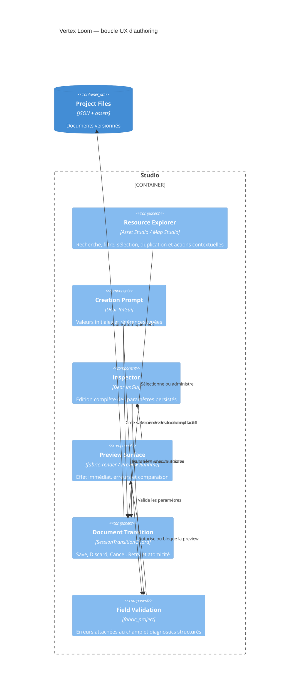
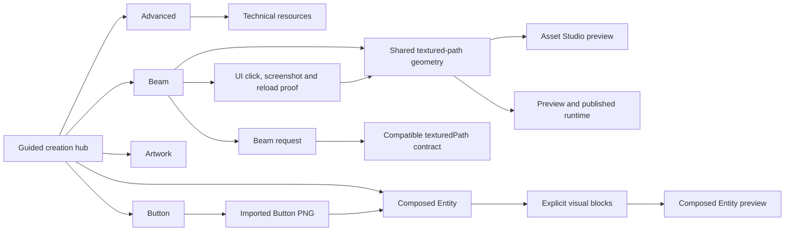

# C4 Component — parcours Studio et propriété des paramètres

## Règle de propriété des paramètres

| Surface | Responsabilité obligatoire |
| --- | --- |
| Creation Prompt | Valeur initiale, référence typée, défaut documenté |
| Resource Explorer | Découverte, contexte, chemin, type, dépendances, actions |
| Inspector | Toutes les propriétés persistées, y compris celles ajoutées après création |
| Preview | Résultat visuel/runtime et état invalide explicite |
| Validator | Erreur par champ, chemin et suggestion de correction |
| CommandStack | Undo/redo, dirty, autosave et récupération |

## Parcours nominal

1. Ouvrir/créer le projet ; afficher le rail de ressources et l'état dirty.
2. Rechercher une ressource par nom, ID ou type ; sélectionner sans saisie libre.
3. Créer ou ouvrir ; sauvegarder automatiquement le document précédent s'il est valide.
4. Régler les paramètres dans l'inspecteur ; chaque changement passe par une commande.
5. Prévisualiser immédiatement dans la même surface et corriger les erreurs au champ.
6. Composer la map/scène avec les références existantes et publier après validation.
7. Lancer Preview Runtime ; toute divergence renvoie à la ressource et au paramètre concernés.

## Parcours d'échec

Une référence absente, une valeur hors domaine ou une écriture disque échouée ne
doit jamais fermer le document courant. L'interface affiche la ressource, le
champ et la cause, puis propose `Retry`, `Discard` ou `Cancel`.
# Asset Studio guided creation workspace

Asset Studio presents user-facing visual creations first: Beam, Button,
Artwork and composed Entity. Button always references an imported project PNG;
there is no generated Eye or generated Button preset. Internal resource types remain available through
an explicit advanced workspace so existing project contracts stay readable and
editable without making engine concepts part of the normal creation path.

Beam is the guided authoring type for the persisted textured-path contract.
The internal `beam` request is distinct from the legacy `seam` preset while
existing JSON and resource identifiers remain compatible. Its preview and
published rendering use the shared arc-length ribbon geometry builder; the
manifest `defaultStrokeTexture` initializes newly created Beam and thread-based
presets, while a manually selected texture remains local to the selected
resource.

