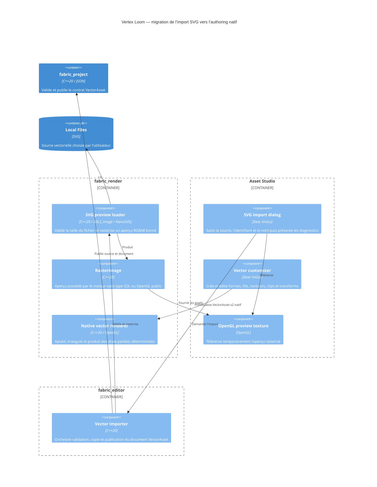

# C4 Component — sources et authoring vectoriels

## Contract

- L'import accepte uniquement l'extension `.svg`, sans tenir compte de la
  casse, puis laisse NanoSVG vérifier le contenu.
- La source SVG originale est copiée sans conversion. Après migration elle
  devient `sourceKind = linkedSvg` et reste prévisualisée par NanoSVG.
- Un document `sourceKind = native` ne dépend pas d’un SVG : il porte sa
  géométrie, ses fills, contours, clips et transforms versionnés.
- Une conversion de SVG lié vers natif est explicite et doit présenter les
  éléments non pris en charge avant publication.
- Le fichier source ne dépasse pas 8 Mio et l'aperçu rasterisé tient dans un
  carré de 2048 pixels de côté sans dépasser 4194304 pixels.
- L'import refuse tout identifiant ou SVG invalide et ne remplace jamais un
  asset existant.
- La source est publiée avant le document JSON atomique ; le document est le
  marqueur rendant le vecteur découvrable par les outils et le runtime.
- L'aperçu OpenGL utilise exactement les pixels validés lors de l'import.
- Le renderer natif et le personnalisateur représentés ici sont les composants
  cibles de l’étape suivante ; l’import opaque actuel reste fonctionnel pendant
  la migration.
