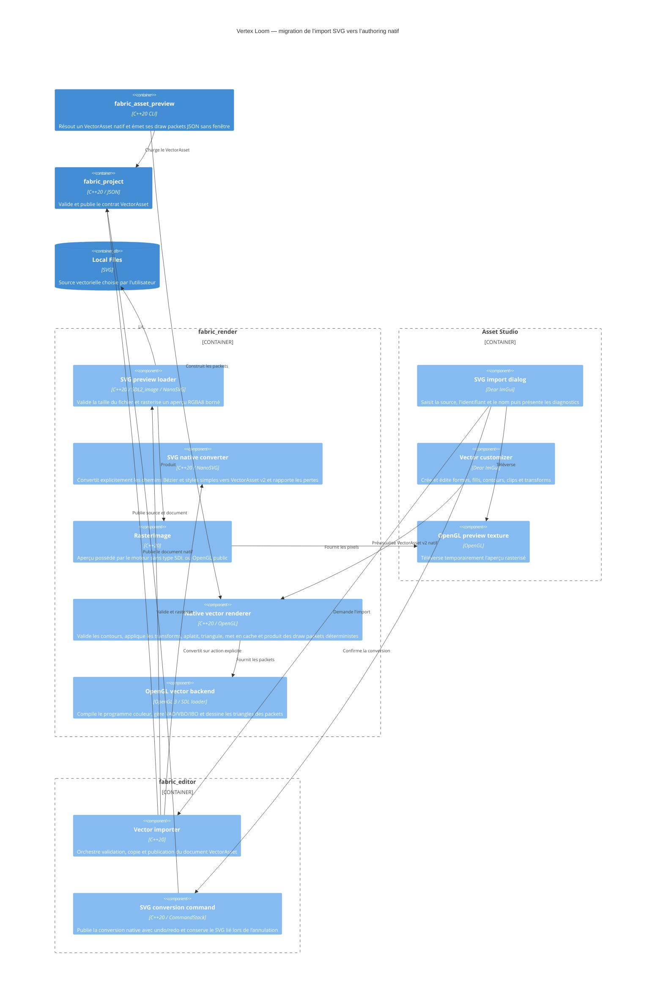

# C4 Component — sources et authoring vectoriels

## Contract

- L'import accepte uniquement l'extension `.svg`, sans tenir compte de la
  casse, puis laisse NanoSVG vérifier le contenu.
- La source SVG originale est copiée sans conversion. Le lecteur migre les
  documents v1 en mémoire vers `sourceKind = linkedSvg`, sans réécrire le SVG,
  qui reste prévisualisé par NanoSVG.
- Le contrat réserve `sourceKind = native` à une géométrie sans dépendance SVG.
  Le socle actuellement chargeable couvre taille, origine, nœuds stables,
  transforms, rectangles, ellipses et fills couleur, transparents ou image.
  L’image possède cadrage, transform, opacité et liaison à la déformation ; le
  registre vérifie sa référence texture. Chemins, contours et clips restent des
  extensions explicites.
- Une conversion de SVG lié vers natif est explicite et doit présenter les
  éléments non pris en charge avant publication. Le convertisseur NanoSVG
  couvre les chemins cubiques, fills couleur et contours simples ; gradients et
  autres paints non supportés produisent un diagnostic et ne sont jamais
  supprimés silencieusement.
- Asset Studio expose la conversion dans l’inspecteur du SVG lié. La commande
  est réversible, sauvegarde le `VectorAsset v2 native` au même emplacement
  JSON et ne modifie jamais le fichier SVG source.
- `fabric_asset_preview <project> <vector-id>` valide le document natif et
  émet les sommets, indices, contours, fills et UV des draw packets en JSON.
- Le fichier source ne dépasse pas 8 Mio et l'aperçu rasterisé tient dans un
  carré de 2048 pixels de côté sans dépasser 4194304 pixels.
- L'import refuse tout identifiant ou SVG invalide et ne remplace jamais un
  asset existant.
- La source est publiée avant le document JSON atomique ; le document est le
  marqueur rendant le vecteur découvrable par les outils et le runtime.
- L'aperçu OpenGL utilise exactement les pixels validés lors de l'import.
- Le renderer natif et le personnalisateur représentés ici sont les composants
  cibles de l’étape suivante ; le document natif est déjà persistant mais ne
  possède désormais des draw packets headless déterministes pour la géométrie
  native. Les chemins auto-intersectants sont rejetés par le validateur. Le
  cache headless est indexé par le JSON canonique du document et la tolérance
  de courbe, ce qui invalide automatiquement une version modifiée ; l’import
  opaque reste fonctionnel. Chaque draw packet porte soit une couleur solide,
  soit la référence texture et les UV transformées du fill image, ainsi que la
  même triangulation de silhouette ; aucun atlas ni bitmap dérivé n’est créé.
  Les sommets sont exprimés dans l’espace monde après application du transform
  du nœud et de ses parents dans l’ordre stable de la hiérarchie.
  Le backend OpenGL 3 compile ses shaders et possède ses buffers via les
  fonctions chargées par SDL ; il refuse explicitement les fills image tant
  qu’aucun résolveur de textures n’est fourni, mais dessine les contours
  ouverts et fermés avec le même packet.
