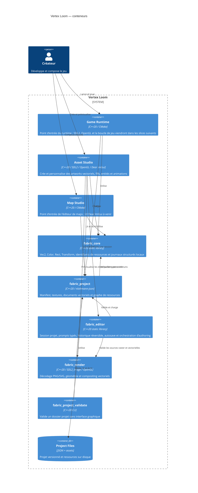

# C4 Container

## Scope and assumptions

Les trois applications sont des exécutables desktop. Shared Core est une
bibliothèque sans état distant. Le premier squelette CMake expose les cibles
`fabric_core`, `asset_studio`, `map_studio`, `game_runtime` et
`fabric_core_smoke`. Le composant `fabric_project` et son validateur headless
constituent le premier contrat de données partagé. Asset Studio utilise
`fabric_editor` pour la session, une coquille SDL2/OpenGL/Dear ImGui et le
premier composant `fabric_render` pour décoder les aperçus PNG et SVG en RGBA8.
La tranche actuellement compilée décode les aperçus PNG/SVG. Le renderer cible
consomme `VectorAsset v2` et le modèle forme/fill/contour/clip d’ADR-0023. Le
pipeline sprite a été retiré par ADR-0025.
