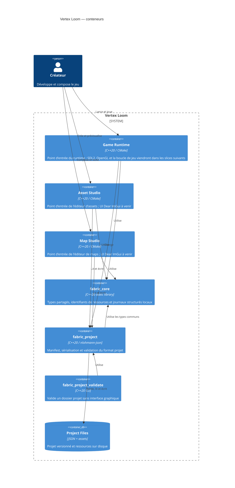

# C4 Container

## Scope and assumptions

Les trois applications sont des exécutables desktop. Shared Core est une
bibliothèque sans état distant. Le premier squelette CMake expose les cibles
`fabric_core`, `asset_studio`, `map_studio`, `game_runtime` et
`fabric_core_smoke`. Le composant `fabric_project` et son validateur headless
constituent le premier contrat de données partagé. Les dépendances graphiques
seront ajoutées avec leurs contrats et ADR lors de leur premier usage réel.
