# C4 Container

```mermaid
C4Container
    title Vertex Loom — conteneurs
    Person(creator, "Créateur", "Développe et compose le jeu")
    System_Boundary(fabric, "Vertex Loom") {
    Container(runtime, "Game Runtime", "C++20 / SDL2 / OpenGL", "Valide un projet avant fenêtre, charge directement une scène et son entryMap ou une map, évalue les AnimationClip v1 et leurs markers franchis, publie les événements de markers des instances animées, applique les pistes de transformation position/rotation/échelle et de matériau couleur/opacité aux instances liées, expose les packets de la dernière frame pour inspection headless, résout les transitions atomiques et les transitions associées aux événements gameplay, remet proprement la boucle au runtime après une transition, traduit les actions SDL configurables vers le CharacterController, interpole Camera2D avec suivi de personnage et limites monde, interpole les positions XPBD, émet les entrées et sorties de zones, culling par chunks avec bounds statiques précalculés, chemin direct des packets statiques visibles et culling géométrique dynamique, lit optionnellement un ReplayDocument par frame, vérifie les checkpoints quantifiés, persiste ProgressSave via SDL_GetPrefPath, mixe et joue les WAV PCM, exécute Box2D à pas fixe et rend le Preview Runtime")
        Container(asset, "Asset Studio", "C++20 / SDL2 / OpenGL / Dear ImGui", "Crée et personnalise des artworks vectoriels, vues raster non destructives, compositions par calques, composants paramétriques, chemins texturés, matériaux, entités, animations et InputDocument v1")
        Container(map, "Map Studio", "C++20 / SDL2 / OpenGL / Dear ImGui", "Compose les maps, leurs prefabs et graphes mécaniques ; édite les paramètres de mécanique par overrides typés et inspecte leur simulation avant publication portable")
        Container(physics, "fabric_physics", "C++20 / Box2D v3.1.1", "Possède le monde physique, compile les graphes mécaniques validés, matérialise leurs capteurs, transporte le personnage de preview et expose un journal de debug borné")
        Container(core, "fabric_core", "C++20 static library", "Vec2, Color, Rect, Transform, identifiants de ressources et journaux structurés locaux")
        Container(projectlib, "fabric_project", "C++20 / nlohmann-json", "Manifest projet, MapPackageManifest v1, textures, documents vectoriels et graphe de ressources")
        Container(editorlib, "fabric_editor", "C++20 static library", "Sessions et commandes partagées par les studios, prompts typés, historique réversible, autosave, preview et publication")
        Container(renderlib, "fabric_render", "C++20 / SDL2_image / OpenGL", "Décodage PNG/SVG, constructeur partagé des draw packets RasterView, compositions, maps, géométrie, chemins texturés et batching stable")
        Container(projectcli, "fabric_project_validate", "C++20 CLI", "Valide un dossier projet sans interface graphique")
        Container(renderbench, "fabric_render_benchmark", "C++20 / SDL2 / OpenGL", "Mesure le rendu d’une scène synthétique dense : packets, draw calls, triangles et p95")
        Container(runtimebench, "fabric_runtime_benchmark", "C++20 / Preview Runtime", "Crée un projet temporaire valide, charge une map dense et mesure culling, draw calls et p95 du runtime")
        ContainerDb(project, "Project Files", "JSON + assets", "Projet versionné et ressources sur disque")
        ContainerDb(mapbundle, "Portable Map Package", "map-package.json + MapDocument + dépendances", "Unité versionnée de publication ; déclare map racine, runtime minimal et chemins relatifs ordonnés")
    }
    Rel(creator, asset, "Crée et prévisualise")
    Rel(creator, map, "Compose et teste")
    Rel(creator, runtime, "Lance et joue")
    Rel(asset, core, "Utilise")
    Rel(map, core, "Utilise")
    Rel(runtime, core, "Utilise")
    Rel(asset, projectlib, "Lit et écrit")
    Rel(asset, editorlib, "Pilote une session")
    Rel(asset, renderlib, "Prévisualise les draw packets raster et vectoriels partagés")
    Rel(map, projectlib, "Lit et écrit")
    Rel(map, physics, "Construit et inspecte la physique")
    Rel(map, mapbundle, "Publie après validation")
    Rel(physics, runtime, "Fournit le monde physique")
    Rel(runtime, projectlib, "Charge")
    Rel(runtime, renderlib, "Rend les draw packets")
    Rel(runtime, mapbundle, "Charge sans conversion manuelle")
    Rel(projectcli, projectlib, "Utilise")
    Rel(renderbench, renderlib, "Mesure")
    Rel(runtimebench, runtime, "Charge et mesure")
    Rel(projectlib, core, "Utilise les types communs")
    Rel(editorlib, projectlib, "Valide et charge")
    Rel(editorlib, renderlib, "Valide les sources raster et vectorielles")
    Rel(renderlib, projectlib, "Construit les draw packets RasterView v1, VectorAsset v2 et TexturedPath v1")
    Rel(projectlib, project, "Valide, lit et écrit")
```

## Scope and assumptions

Les trois applications sont des exécutables desktop. Shared Core est une
bibliothèque sans état distant. Le premier squelette CMake expose les cibles
`fabric_core`, `asset_studio`, `map_studio`, `game_runtime` et
`fabric_core_smoke`. Le composant `fabric_project` et son validateur headless
constituent le premier contrat de données partagé. Asset Studio utilise
`fabric_editor` pour la session, une coquille SDL2/OpenGL/Dear ImGui et le
premier composant `fabric_render` pour décoder les aperçus PNG et SVG en RGBA8.
La tranche actuellement compilée décode les aperçus PNG/SVG. Le renderer cible
consomme `VectorAsset v2` et le modèle forme/fill/contour/clip d’ADR-0023. Le
pipeline sprite a été retiré par ADR-0025.

Pour `TexturedPath v1`, `fabric_render` aplatit les commandes Bézier avec une
tolérance explicite puis dérive un ruban, ses raccords, terminaisons, largeurs
et UV. Seuls le document d'auteur et sa texture appartiennent à
`fabric_project`; les sommets et indices restent un résultat de rendu
reproductible et non persisté.

La preview d'authoring d'une map résout ses instances, entités, composants et
animations en draw packets headless dans `fabric_render`. Map Studio dessine
ce résultat avec le backend OpenGL partagé ; Preview Runtime peut comparer le
même instant sans introduire un format de preview distinct.

Le Preview Runtime expose au code de jeu les événements de trigger et payloads
produits au dernier pas fixe, en complément de ses métriques de culling et de
performance.

`fabric_physics` compile les sept nœuds intégrés de `MechanicGraph` en un plan
headless ordonné de corps, pivots, joints, moteurs, capteurs, contraintes et
liaisons vers les événements déclarés par la map. Ce plan ne contient aucun
identifiant Box2D persistant ; ces handles restent la propriété du monde
physique éphémère.

Map Studio ouvre un `MechanicGraph` dans une session distincte du document map.
Les mutations de nœuds, propriétés et connexions passent par son propre
`CommandStack`, puis la preview recompile et reconstruit entièrement le monde
Box2D. Lecture, pause, pas fixe et reset n'écrivent jamais d'état de simulation
dans le document.

La factory de plateforme tournante vit dans `fabric_editor` et assemble un
graphe générique validé ; `fabric_physics` ne connaît pas ce preset. La preview
évalue les signaux capteur ou événement, applique direction et accélération au
moteur, puis laisse Box2D imposer les limites du joint.

La preview peut ajouter un personnage dynamique générique au même monde. Les
formes sensor détectent physiquement ses entrées et sorties ; la friction des
contacts transporte le personnage. `fabric_physics` publie l'état courant de
chaque activation et un journal borné `begin/end`, consommés par les overlays
de Map Studio sans persistance de handles ou d'état simulé.

Un prefab inline de `MapDocument` peut référencer séparément une entité et un
`MechanicGraph`. Ses overrides ciblent les paramètres déclarés par le graphe ;
le validateur de projet vérifie identifiants et types, puis Map Studio compile
une copie paramétrée pour la preview sans modifier la ressource mécanique. Le
transform uniforme de l'instance déplace corps, pivots et capteurs dans le même
repère monde que son entité visuelle.

Une tranche fonctionnelle suit la même direction de données dans les outils et
le runtime : contrat partagé, commande d'authoring, preview du studio,
sauvegarde dans le projet, composition dans Map Studio, puis chargement du
paquet de map. Une capacité disponible uniquement dans le runtime ne ferme pas
son gate produit.
