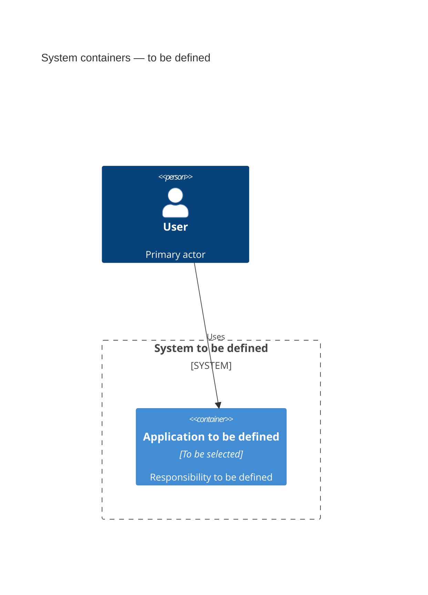

# C4 Container

<!-- Guide: replace this document after discovery.
Describe only the applications, services, interfaces, data stores, and queues actually selected. -->

## Discovery questions

- What are the deployment and runtime boundaries?
- Which flows require a component, sequence, or state diagram?
- Which storage and contracts are required?
