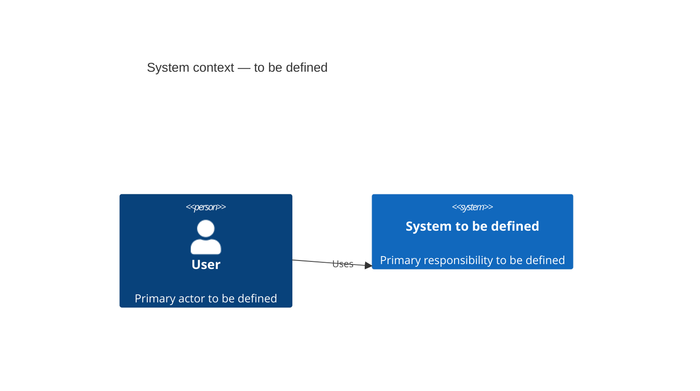

# C4 Context

<!-- Guide: replace this document after discovery.
Describe the system, users, external systems, and major flows.
Use Mermaid C4Context. The agent must ask about genuinely unknown actors or integrations before inventing a boundary. -->

## Discovery questions

- Who uses the system, and for what purpose?
- Which external systems, providers, or regulatory constraints exist?
- What is the exact project boundary?
