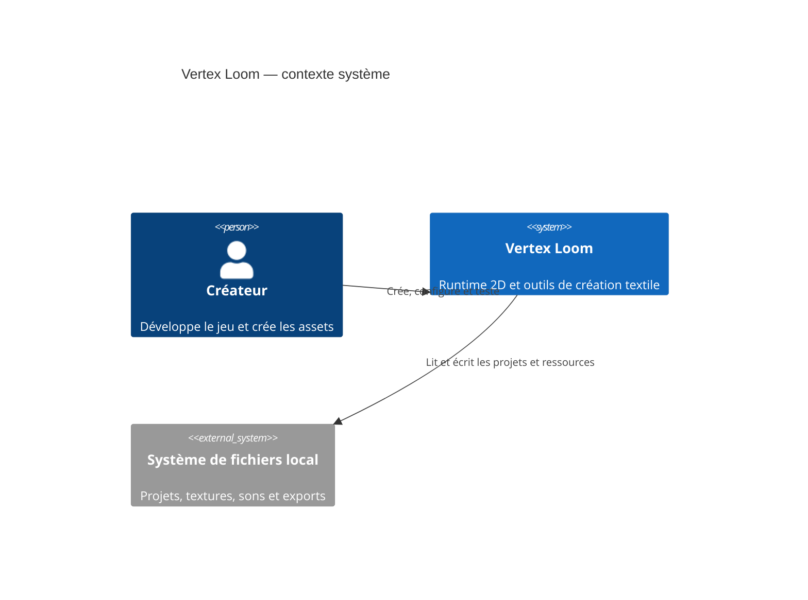

# C4 Context

```mermaid
C4Context
    title Vertex Loom — contexte système
    Person(creator, "Créateur", "Développe le jeu et crée les assets")
    System(fabric, "Vertex Loom", "Runtime 2D et outils de création textile")
    System_Ext(files, "Système de fichiers local", "Projets, textures, sons et exports")
    Rel(creator, fabric, "Crée, configure et teste")
    Rel(fabric, files, "Lit et écrit les projets et ressources")
```

## Scope and assumptions

Le système couvre le runtime, Asset Studio et Map Studio. Aucun service distant
ni compte utilisateur n'est requis ; les assets restent locaux.
