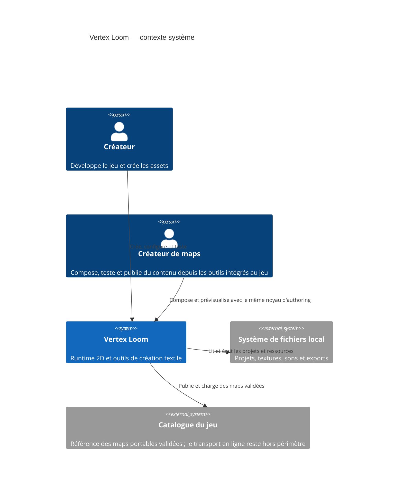

# C4 Context

## Scope and assumptions

Le système couvre le runtime, Asset Studio et Map Studio. Asset Studio et Map
Studio restent les outils de développement de référence ; leurs contrats et
commandes réutilisables pourront être exposés dans le jeu aux créateurs de
maps. Aucun service distant ni compte utilisateur n'est requis : le catalogue
désigne l'interface de publication et de chargement de maps portables, pas un
backend imposé.
