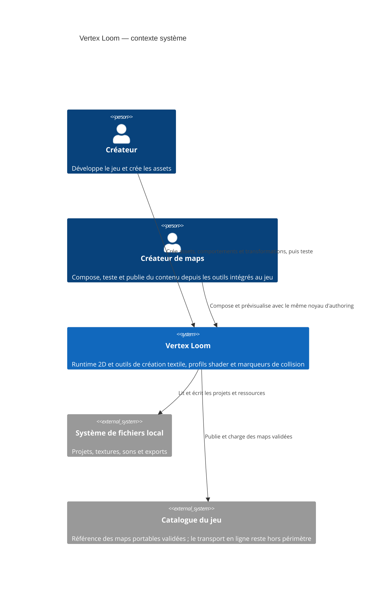
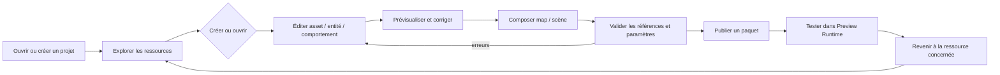

# C4 Context

## Parcours utilisateur de référence

Le premier écran doit répondre à une seule question : « que puis-je faire
maintenant et sur quelle ressource ? ». Le créateur ouvre ou crée un projet,
parcourt une ressource dans le rail Project à gauche, l'édite dans l'Inspector
à droite, la
prévisualise immédiatement, puis compose une map avant validation et
publication. Toute transition conserve le document actif jusqu'à `Save`,
`Discard` ou `Cancel`.

Les paramètres suivent le même cycle dans chaque surface : `Create` expose les
valeurs initiales, `Inspector` expose toutes les valeurs persistées, `Preview`
montre leur effet, et `Validate` explique l'erreur au champ concerné. Un
paramètre disponible à la création ne peut donc pas devenir immuable après
publication.

## Scope and assumptions

Le système couvre le runtime, Asset Studio et Map Studio. Asset Studio et Map
Studio restent les outils de développement de référence ; leurs contrats et
commandes réutilisables pourront être exposés dans le jeu aux créateurs de
maps. Aucun service distant ni compte utilisateur n'est requis : le catalogue
désigne l'interface de publication et de chargement de maps portables, pas un
backend imposé.

La logique d'une entité est authorée comme un `BehaviorGraph` générique. Les
bindings physiques produisent des actions sémantiques, tandis que le même graphe
peut aussi recevoir une décision IA, un événement de map, un trigger, un timer
ou une propriété. Une transformation est une action explicite du comportement
qui remplace une instance selon une ressource de politique versionnée ; aucun de
ces contrats ne distingue joueur et monstre.
