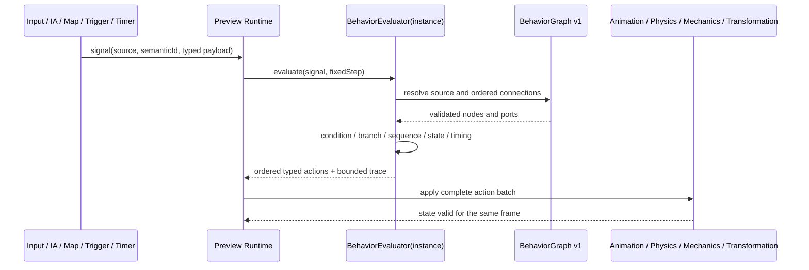

# Flux — signal vers action de comportement

Une action sémantique possède le même chemin quel que soit son producteur. Les
actions sont ordonnées par le graphe et appliquées comme un lot pour éviter un
état intermédiaire incohérent, notamment lors d'une transformation.
