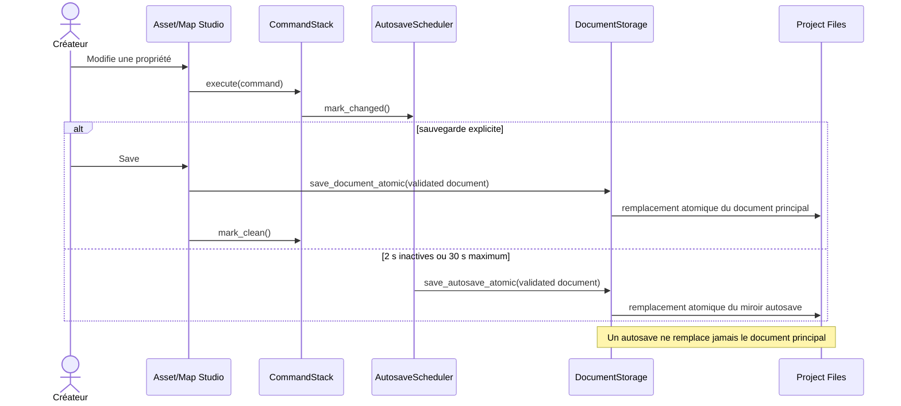
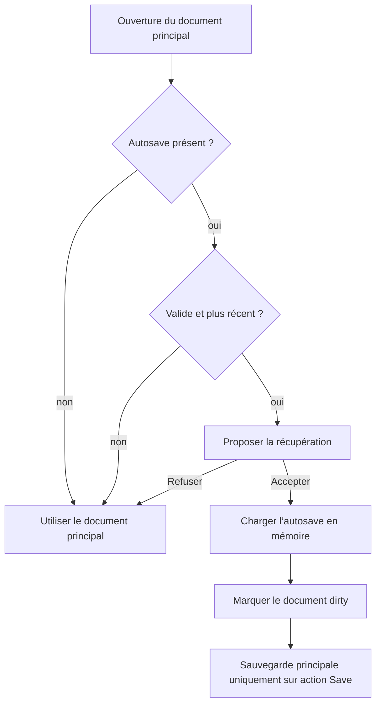

# Flux — sauvegarde et récupération d’un document

## Invariants

- Une commande échouée ne modifie ni l’historique ni son état dirty.
- Undo et redo déplacent le curseur seulement après succès de la commande.
- Une fusion continue conserve la valeur initiale pour undo et la dernière
  valeur pour redo.
- Un document et son autosave passent le même validateur avant écriture ou
  récupération.
- Les chemins absolus, traversants et les parents résolus hors projet sont
  refusés.
- Refuser ou accepter une récupération ne modifie aucun fichier principal.
- Un retour par undo au point propre écrit le contenu principal dans le miroir
  afin de neutraliser un autosave obsolète sans supprimer de fichier.
