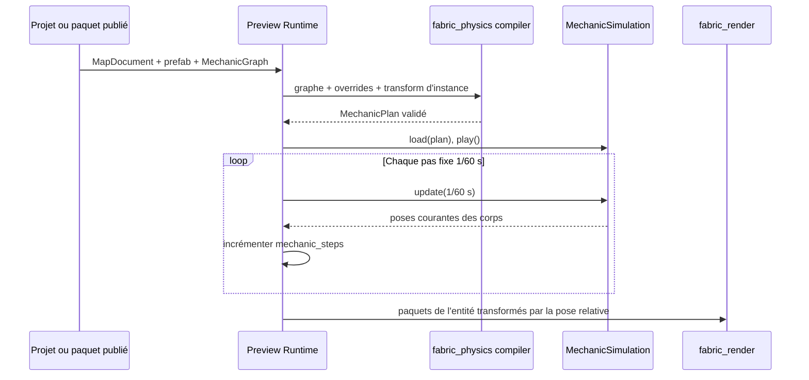

# Flux — Instance mécanique publiée dans Preview Runtime

Le chargement est atomique du point de vue du runtime : une ressource absente,
un plan invalide, un monde Box2D impossible à créer ou plusieurs corps liés à
la même racine visuelle refusent la map avant toute fenêtre SDL. Une instance
sans corps lié reste visuelle et statique.

`PreviewRuntime` expose le nombre d'instances, les états de corps par
identifiant d'instance et le total `mechanic_steps`. Ces observations servent
aux tests paquet → runtime sans rendre persistants les handles ou états Box2D.
