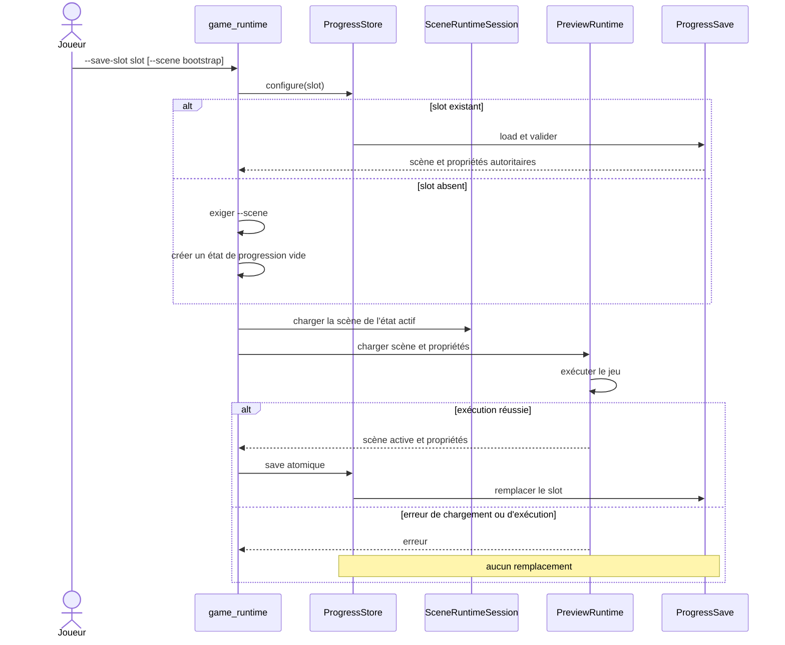

# Flux — reprise et sauvegarde de progression runtime

## Invariants

- Un slot existant gagne sur `--scene`; cette option amorce seulement un slot
  absent.
- `--save-slot` et `--save-path` utilisent le même flux et sont mutuellement
  exclusifs.
- Une sauvegarde invalide arrête le lancement avant la création d'une fenêtre.
- Une exécution sans mutation explicite conserve toutes les propriétés.
- Seule une exécution réussie peut remplacer atomiquement le slot.
