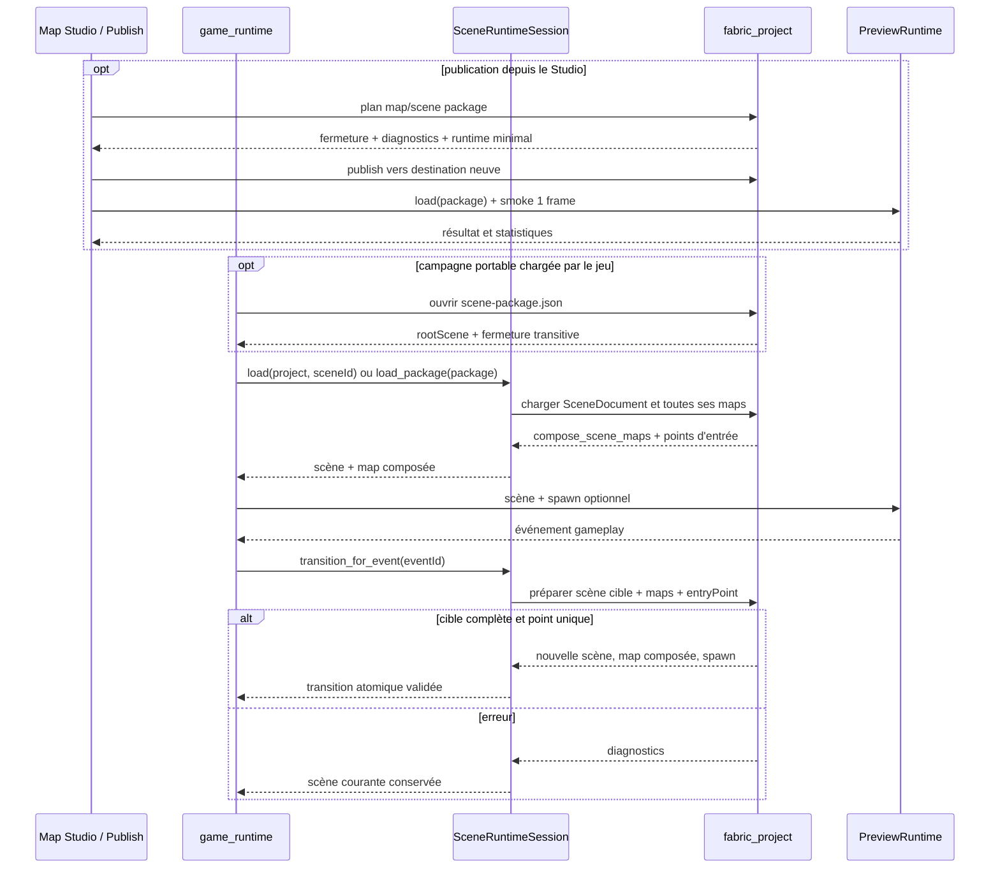

# Flux — Composition multi-map et transition de scène

La map composée prend l'identifiant de la scène et reste éphémère. La session
expose le `SceneEntryPoint` résolu ; `game_runtime` transmet sa position dans
`PreviewRuntimeOptions.character_spawn` au chargement suivant.

La publication headless utilise
`fabric_map_package_export --scene <scene-id> <projet> <destination>`. Le
manifeste racine, les scènes atteignables, toutes leurs maps et les dépendances
de chaque map sont copiés avant l'écriture atomique de `scene-package.json`.
`game_runtime --package` détecte ensuite le type de paquet et conserve la scène
active dans la boucle sans dépendre du projet source.

Le workspace `Publish` de Map Studio utilise les mêmes opérations. Il affiche
la fermeture avant écriture, refuse une destination existante puis recharge le
dossier produit avec `PreviewRuntime` en mode smoke. Le résultat visible ne
peut donc pas confondre validation du plan, copie du paquet et chargement
effectif par le runtime.
