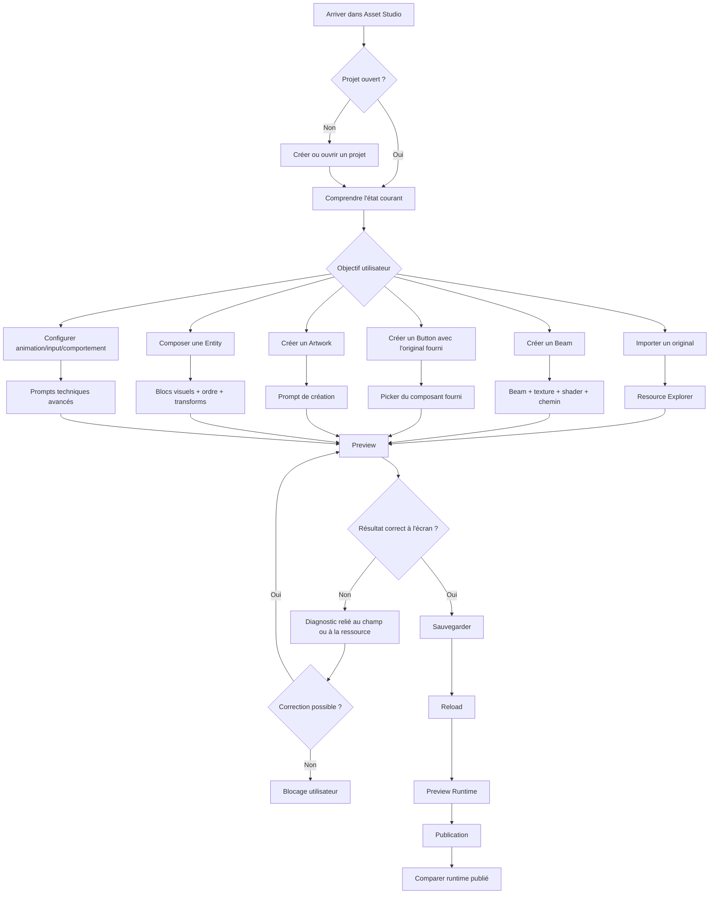
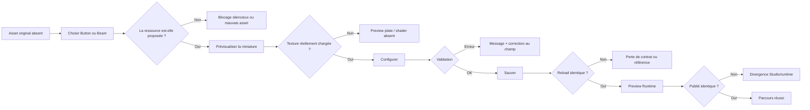

# Audit des chemins utilisateur — Asset Studio et Map Studio

Date : 31 août 2026
Statut : audit en cours, parcours non validés
Note UX de départ : **2/10**

Ce document décrit les chemins qu'un utilisateur peut tenter sans connaître
les contrats internes. Il ne transforme pas un test de contrat en preuve UX :
un chemin n'est considéré comme réussi que si l'utilisateur comprend l'action,
obtient le bon résultat visible, peut corriger une erreur, sauvegarder,
recharger et publier.

## Carte générale des parcours



## Parcours testés ou vérifiés

| ID | Chemin utilisateur | Résultat actuel | Blocage principal | Priorité |
| --- | --- | --- | --- | --- |
| U01 | Ouvrir Asset Studio sans projet | Partiel | Le projet doit être créé/ouvert avant toute création ; le chemin est compréhensible mais reste technique. | P2 |
| U02 | Créer un projet puis commencer | Partiel | L'état vide est présent, mais le prochain objectif dépend encore du menu générique de ressources. | P2 |
| U03 | Importer un PNG original | Partiel | L'import peut définir `defaultStrokeTexture`, mais l'utilisateur ne voit pas clairement que cette image devient la base Beam. | P1 |
| U04 | Importer plusieurs PNG et choisir le bon | Partiel | Le picker existe, mais il faut contrôler la miniature, le nom et la référence réellement consommée par le Beam. | P1 |
| U05 | Ajouter une texture existante | Conforme techniquement | Le chemin est couvert par `Add existing`, mais il n'est pas relié explicitement au parcours Beam guidé. | P1 |
| U06 | Créer un Beam neuf | Partiellement corrigé | Le menu utilise désormais une demande `VisualPresetKind::beam` distincte du legacy `seam`; le contrat JSON et le rendu écran restent à prouver. | P0 |
| U07 | Créer plusieurs Beams | Partiel | Le fallback utilise `defaultStrokeTexture`, sans preuve que la ressource existe, est chargée et reste la texture attendue. | P0 |
| U08 | Changer la variante texture d'un Beam | Partiel | Le combo existe et la référence est locale, mais aucune preuve écran ne confirme la continuité et le rechargement. | P1 |
| U09 | Régler répétition/orientation sur ligne, courbe et segments | Contrat géométrique couvert | L'arc-length geometry est testée ; le parcours guidé complet et les captures comparables restent absents. | P1 |
| U10 | Régler color/effect/shine/holography du Beam | Partiel | Les champs sont maintenant disponibles dans l'inspecteur du chemin texturé ; la capture écran shader et le round-trip restent à prouver. | P0 |
| U11 | Créer un Button avec l'original fourni | Partiel | Le parcours exige maintenant une texture originale sélectionnée ; l'index est rafraîchi à l'ouverture de l'assistant et signale explicitement l'absence de texture. Le round-trip écran reste à prouver. | P0 |
| U12 | Créer un Eye | Supprimé | Le faux type Eye, sa factory et ses fixtures ont été retirés ; les originaux concernés passent par Button comme PNG. | Fermé |
| U13 | Créer un Artwork | Partiel | Le prompt et la publication existent ; la personnalisation complète et le rendu final restent incomplets. | P1 |
| U14 | Créer une Entity composée de plusieurs blocs | Bloqué UX | La création démarre avec un drawable et l'ajout des autres blocs est caché dans l'inspecteur, sans assistant de composition. | P1 |
| U15 | Déformer un bloc uniquement | Non prouvé | Les contrats de déformation existent, mais aucune preuve E2E ne démontre l'isolation visuelle du bloc sélectionné. | P1 |
| U16 | Déformer toute l'Entity | Non prouvé | L'ordre composition puis déformation globale n'est pas démontré à l'écran. | P1 |
| U17 | Créer une animation | Partiel | Le prompt et la timeline sont couverts techniquement ; le ciblage et le résultat visible doivent être rejoués comme utilisateur novice. | P2 |
| U18 | Créer des inputs et comportements | Partiel | Les prompts existent, mais le lien entre action, consommateur et Preview Runtime n'est pas suffisamment guidé. | P2 |
| U19 | Sauvegarder, annuler, undo/redo, recharger | Partiel | Les fondations passent ; chaque nouveau parcours Beam/Button/Entity doit encore prouver le round-trip complet. | P1 |
| U20 | Preview Runtime puis publication | Partiel | Les tests runtime passent, mais aucune comparaison écran systématique ne relie l'écart à un champ utilisateur. | P1 |
| U21 | Ouvrir Map Studio depuis le projet | Partiel | Le parcours Map est fonctionnel dans les tests, mais il reste séparé du parcours de création visuelle utilisateur. | P2 |
| U22 | Créer map, scène, mécanique, trigger et publier | Partiel | Les contrats et E2E Map passent ; la découverte des concepts reste trop moteur pour un utilisateur normal. | P2 |

### Vérification écran du 31 août 2026

Une capture réelle du scénario `asset_studio_beam_vector_canvas_e2e` a été
inspectée après conversion PNG. Elle montre `Beam Border` sélectionné comme un
grand remplissage bleu dans le canvas vectoriel, tandis que la texture Thread
n'est pas perceptible. Cette capture ne constitue donc pas une preuve de Beam
texturé : soit la sélection masque le rendu, soit le rendu image n'est pas
branché dans cette vue. Le statut U06/U10 reste P0 tant qu'une capture isolée,
non sélectionnée, montre la texture originale et le shader.

Le contrôle d'interface macOS n'a pas pu récupérer la fenêtre interactive
Asset Studio : le processus est lancé, mais l'accessibilité renvoie un
identifiant système en conflit avec Aperçu et expire. Les captures automatisées
ne doivent pas être présentées comme une validation manuelle complète.

## Chemins d'échec à rejouer



## Points de friction UX observés dans le code

### 1. Le menu ne suffit pas à constituer un parcours guidé

Le menu propose `Beam / Stroke`, `Button`, `Artwork` et `Composed Entity`, mais
la sélection du type ne conduit pas toujours à un assistant
complet. Le cas Button route directement vers la création d'Entity et doit
sélectionner explicitement l'image originale fournie.

### 2. Le Button utilise une image source obligatoire

Les anciens assets nommés `head` sont les images de boutons du jeu. Le parcours
guidé Button les traite donc comme des textures originales et ne fabrique aucun
motif. La sélection reste explicite : aucune ressource n'est devinée. L'index
des textures est rafraîchi quand l'assistant s'ouvre afin d'inclure les PNG
importés depuis l'ouverture précédente.

### 3. Beam et Seam doivent rester compatibles sans être confondus

La création guidée utilise maintenant `VisualPresetKind::beam`, distinct du
preset historique `seam`. Le contrat JSON reste `texturedPath` pour préserver
la compatibilité, mais les outils de diagnostic et les captures doivent encore
prouver que l'utilisateur ne voit pas le legacy `Seam` dans le parcours normal.

### 4. La texture de base est une référence implicite

`defaultStrokeTexture` initialise la demande si elle est vide. Ce mécanisme ne
prouve ni la présence du fichier, ni le chargement GPU, ni le fait que l'image
choisie par l'utilisateur soit celle réellement visible. Le parcours doit
afficher la source active et son état de résolution.

### 5. Le shader est testé par données, pas par résultat perceptible

Le renderer OpenGL applique le shader aux batches et les tests de presets
vérifient les paramètres. Il manque toutefois le chemin écran complet : créer
le Beam dans la modal, observer le shader, sauvegarder, recharger puis comparer
Preview Runtime et runtime publié.

### 6. La séparation Avancé n'est pas complète

Le menu de création possède un sous-menu `Advanced`, mais l'arbre de ressources
continue d'afficher au même niveau les groupes techniques comme `Visual
component`, `Visual composition`, `Transformations`, `Behaviors` et `Maps`.

### 7. Le test vectoriel écran doit rester indépendant par étape

Lors de l'audit, la suite complète a produit **85/86** avec l'échec de
`asset_studio_vector_canvas_e2e`. Une relance isolée a également échoué et a
produit :

```text
Freeform path E2E failed: authored=2, reloaded=2, seed=yes
```

Le scénario a été stabilisé ensuite en empêchant une assertion précédente de
court-circuiter l'étape de création libre. Les captures restent toutefois une
preuve du canvas vectoriel et non encore une preuve complète du Beam guidé.

## Couverture actuelle des tests

- `npm test` : 41/41 réussis.
- CTest complet : un run d'audit a produit 85/86, puis le vector canvas E2E a
  été relancé et corrigé pour exécuter toutes ses étapes indépendamment.
- Les tests de contrats Beam vérifient la texture par défaut, le profil Thread,
  les couleurs, la répétition et les paramètres shader.
- Les E2E existants couvrent import, texture, drag-and-drop, Entity, animation,
  transformation et canvas vectoriel.
- Il n'existe pas encore d'E2E dédié à la création guidée Button avec sélection
  explicite de l'original.
- Il n'existe pas encore de preuve écran complète Beam → Preview → publication.
- Il n'existe pas encore d'E2E Entity composée avec trois blocs et déformation
  locale/globale comparée.

## Ordre de correction proposé

1. Button : picker obligatoire de l'original, miniature, erreur bloquante et
   aucun fallback silencieux.
2. Beam : contrat explicite, texture de base résolue et visible, puis capture
   écran shader isolée.
3. Stabiliser le vector canvas E2E avant d'utiliser ses captures comme preuve.
4. Construire l'assistant Entity multi-blocs avec portée de déformation
   explicite.
5. Rejouer les parcours Artwork, animation, input, Map et publication
   comme utilisateur novice.
6. Recalculer la note UX après les P0, sans réutiliser automatiquement les
   anciennes cases cochées.

## Critère de sortie utilisateur

Un nouvel utilisateur doit pouvoir importer ses originaux, créer un Beam ou un
Button en choisissant explicitement la bonne ressource, composer une Entity,
prévisualiser le résultat, le sauvegarder, le recharger et le publier sans
connaître `seam`, `VisualComponent`, `texturedPath`, `XPBD`, les IDs internes ou
la structure des fichiers JSON.

## Audit technique — orientation des images

- [x] Vérifier les fichiers PNG originaux et leur orientation native.
- [x] Vérifier les métadonnées `RasterView` des textures externes.
- [x] Vérifier les conventions UV de l’aperçu ImGui et du renderer OpenGL.
- [x] Corriger le retournement vertical du quad raster dans le builder partagé.
- [x] Aligner les miniatures de picker sur la convention de l’aperçu principal.
- [ ] Ajouter une capture écran dédiée d’une texture asymétrique dans Asset Studio,
      Preview Runtime et runtime publié.

Constat : les PNG fournis ne contiennent pas d’orientation EXIF et les nouvelles
métadonnées ont une rotation à `0°`. Le retournement venait d’un mélange entre
les coordonnées de crop haut-vers-bas et l’échantillonnage OpenGL bas-vers-haut,
ainsi que d’une miniature qui n’inversait pas V comme les autres aperçus.
