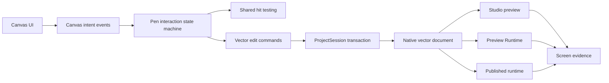

# Audit et plan de refactor — Asset Studio

Date : 31 août 2026
Statut : plan proposé, aucune modification produit dans cette passe

## Résultat de l'audit

La suite automatisée passe, mais elle ne représente pas le parcours utilisateur
réel. `ctest --test-dir build -C Debug --output-on-failure` passe à 86/86 ; le
test `asset_studio_vector_canvas_e2e` injecte cependant des événements et des
modifications directes, et désactive explicitement `freeform_gesture`. Il ne
prouve donc pas que l'outil Pen permet de dessiner un chemin à la souris.

### Blocage critique : Pen

Le bouton `Pen` n'est disponible que dans le canvas d'un vecteur natif. Une
forme rectangle ou ellipse ne devient pas un chemin quand l'utilisateur choisit
Pen. Il faut d'abord trouver `Start new freeform path` dans l'inspecteur.

Le clic Pen mélange cinq opérations dans une seule routine : sélection de nœud,
sélection d'ancre, insertion de segment, déplacement de segment et modification
de poignée Bézier. La sélection d'une ancre est évaluée avant l'insertion, ce
qui peut empêcher l'ajout d'un point près d'un segment ou d'une extrémité.

Les erreurs de `set_selected_vector_node` sont ignorées dans plusieurs chemins
du canvas. L'utilisateur ne reçoit donc pas de raison quand une insertion est
refusée par la validation ou par la pile de commandes.

Le mode Pen n'a pas de modèle d'interaction complet : pas de commande claire
pour commencer, terminer, annuler ou fermer un tracé, pas d'état visible
`drawing`, et pas de distinction explicite entre dessiner et éditer.

### Parcours fonctionnels

| Parcours | État observé | Risque UX |
| --- | --- | --- |
| Ouvrir un projet | Fonctionnel par contrat | Le projet réel dépend du chemin choisi ; l'état vide reste technique. |
| Importer un PNG | Fonctionnel techniquement | L'utilisateur ne sait pas automatiquement si l'image est une base Beam ou une simple texture. |
| Choisir une texture Thread | Référence persistée | Le choix par défaut dépend entièrement de `defaultStrokeTexture`; aucune résolution visuelle suffisamment explicite. |
| Créer un Beam | Contrat validé | Le preview vectoriel sélectionné masque le rendu et ne prouve pas la texture/shader. |
| Éditer un Beam | Partiel | Le Pen du `texturedPath` et le Pen vectoriel sont deux systèmes différents sous des noms proches. |
| Créer un Button fourni | Contrat corrigé | La sélection explicite est obligatoire, mais le parcours écran dédié n'est pas couvert. |
| Créer un Eye/Artwork | Contrat partiel | La distinction entre ressource, composant et aperçu n'est pas assez guidée. |
| Composer une Entity | Contrat multi-blocs ajouté | Les blocs sont persistés, mais la prévisualisation et les déformations demandent une validation écran. |
| Déformation locale | Non prouvée | Les libellés existent ; l'isolation d'un bloc n'est pas démontrée par E2E. |
| Déformation globale | Non prouvée | L'ordre composition puis déformation n'est pas démontré visuellement. |
| Animation/Input/Behavior | Tests de contrats/E2E présents | Le lien entre l'intention utilisateur et le consommateur runtime reste moteur. |
| Map/Scene/Mechanic | Tests présents | Parcours séparé mais encore mélangé dans la navigation générale. |
| Save/Reload/Undo/Redo | Fondations couvertes | Pas de preuve complète par fonctionnalité visuelle et par asset original. |
| Preview/Publication | Smoke tests verts | Pas de comparaison d'images entre Studio, Preview Runtime et runtime publié. |

## Architecture cible du refactor

Le canvas ne doit plus modifier directement un nœud selon une combinaison
implicite de flags. Il doit produire une intention (`begin_path`, `append_line`,
`append_cubic`, `move_anchor`, `move_handle`, `finish_path`, `cancel_gesture`)
que la machine d'état valide et transforme en commande undoable.

## Plan de refactor priorisé

### P0 — rendre Pen utilisable

État au 31 août 2026 : première tranche implémentée, mais E2E souris dédié
encore requis. Le canvas expose maintenant `New path` quand Pen est actif,
permet de convertir la forme sélectionnée en chemin, affiche les commandes de
fin/annulation et remonte un diagnostic de démarrage. Cette tranche ne ferme
pas le P0 tant que les événements souris du bouton et le dessin libre ne sont
pas testés sans mutation directe du modèle.

1. Extraire `CanvasInteractionController` dans le module editor.
2. Définir les états `idle`, `drawing_path`, `editing_path`, `dragging_anchor`,
   `dragging_handle` et `pending_close`.
3. Ajouter une action visible `New path` quand Pen est sélectionné, disponible
   sur toute forme ; ne plus exiger de trouver l'action dans l'inspecteur.
4. Implémenter le parcours souris explicite : clic pour le point, clic-drag
   pour la poignée, clic sur le premier point pour fermer, Entrée pour terminer,
   Échap pour annuler.
5. Partager le hit testing des ancres, poignées et segments, avec tolérance
   exprimée en pixels et convertie une seule fois en unités monde.
6. Remonter chaque rejet de `ProjectSession` dans un diagnostic près du canvas.
7. Regrouper un geste complet en une commande undo/redo atomique.

Critères de sortie P0 : nouveau chemin depuis rectangle, ligne, courbe et
canvas vide ; ajout de points ; Bézier ; fermeture ; annulation ; suppression ;
undo/redo ; sauvegarde/reload ; aucune mutation d'un autre nœud.

### P0 — prouver le rendu

1. Ajouter un mode d'inspection `Show selection overlays` désactivable.
2. Capturer le Beam sans sélection, avec texture Thread originale, sur ligne,
   courbe et segments multiples.
3. Capturer séparément texture, couleur primaire, couleur d'effet, opacité,
   répétition et holographie.
4. Comparer les mêmes fixtures entre Asset Studio, Preview Runtime et runtime
   publié par une preuve image ou un rapport de pixels.

### P1 — unifier les chemins graphiques

1. Donner au `texturedPath` Beam le même contrôleur Pen que le vecteur, avec un
   modèle de chemin adapté à ses points et tangentes.
2. Afficher clairement `Beam`, `Zipper` et `Legacy Seam` comme comportements de
   deux vecteurs/path compatibles, sans dupliquer des écrans incohérents.
3. Afficher la texture active, sa miniature, son ID et son origine
   (`project default` ou `local override`) dans chaque inspector.
4. Interdire tout fallback silencieux et proposer une correction actionnable.

### P1 — refactor Entity

1. Déplacer la composition dans un éditeur de blocs visuels central.
2. Faire de la déformation un modificateur attachable à un bloc ou à la
   composition, avec portée visible et ordre d'exécution affiché.
3. Ajouter des tests d'isolation locale et de déformation globale sur trois
   blocs, avec comparaison avant/après.

### P2 — navigation et séparation des responsabilités

1. Séparer `Créer`, `Éditer`, `Preview/Publier` et `Avancé` dans la navigation.
2. Sortir Maps, scènes, mécaniques et détails moteur du parcours visuel normal.
3. Garder les contrats historiques accessibles via un mode expert explicite.
4. Ajouter une aide contextuelle orientée intention utilisateur, pas type moteur.

## Stratégie de tests à ajouter

### Tests unitaires

- machine d'état Pen pour chaque transition souris/clavier ;
- hit testing invariant au zoom, pan, rotation et échelle ;
- conversion monde/local avec échelles négatives ;
- fermeture et annulation sans chemin invalide ;
- commandes atomiques undo/redo ;
- messages d'erreur de validation reliés à l'intention.

### Tests E2E écran

- `pen_new_path_from_rectangle_e2e` ;
- `pen_draw_line_and_finish_e2e` ;
- `pen_draw_bezier_and_close_e2e` ;
- `pen_cancel_does_not_mutate_e2e` ;
- `pen_delete_anchor_and_reload_e2e` ;
- `beam_texture_default_visible_e2e` ;
- `beam_shader_controls_visible_e2e` ;
- `composed_entity_three_blocks_e2e` ;
- `local_vs_global_deformation_e2e` ;
- `studio_preview_published_pixel_match_e2e`.

Chaque E2E doit utiliser les événements souris réels du canvas, produire une
capture avant/après et vérifier le document sauvegardé. Une modification
directe du modèle ne doit pas remplacer l'action utilisateur testée.

## Ordre d'exécution recommandé

1. Corriger Pen et ses diagnostics.
2. Ajouter les E2E souris réels Pen avant tout nouveau polish UX.
3. Corriger l'inspection visuelle Beam et produire les captures non sélectionnées.
4. Unifier Beam/Zipper et leurs contrôles de chemin.
5. Finaliser Entity et les portées de déformation.
6. Réorganiser la navigation et recalculer la note UX.

La note actuelle reste **2/10** tant que le Pen réel et la preuve visuelle Beam
ne sont pas validés.
