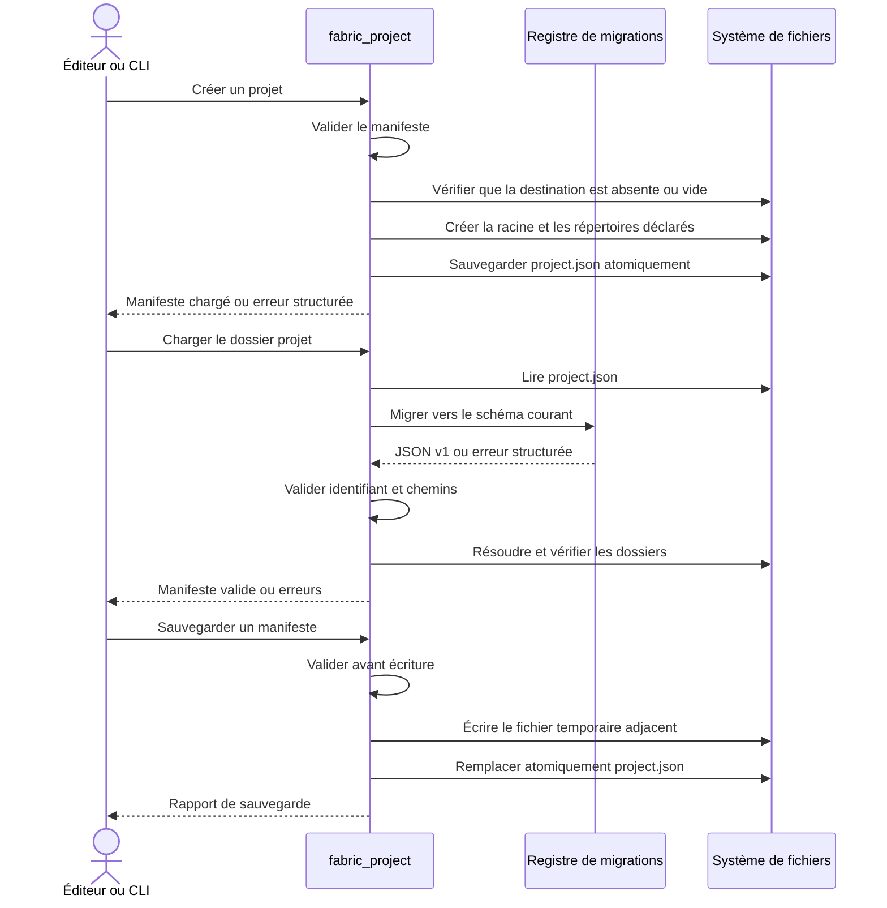

# Validation et sauvegarde d'un projet

Une erreur de parsing, migration, validation ou accès disque arrête le flux et
retourne un `ValidationReport`. La création n'écrase jamais une destination
non vide ; une erreur d'accès peut laisser les seuls répertoires nouvellement
créés, mais aucun nettoyage destructif n'est tenté automatiquement. En mode
`--json`, la CLI transforme chaque erreur en événement JSON Lines avec son code
et son champ source.
